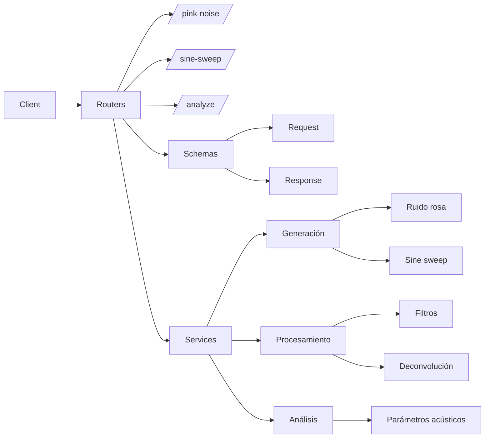

# RIR-API

API REST para procesamiento y análisis de respuestas al impulso según la norma ISO 3382.

## Descripción

RIR-API es un proyecto educativo que implementa una API REST (FastAPI) con una cadena completa de procesamiento acústico: generación de señales de excitación, procesamiento de respuestas al impulso por bandas de octava y cálculo de parámetros acústicos (EDT, T20, T30) según la norma ISO 3382-1.

## Integrantes

- Agustin Birarelli
    - Legajo 69574
    - Responsable de generación de señales

- Ivo Manoli
    - Legajo 64189
    - Responsable de procesamiento

- Gaspar Dallinge
    - Legajo 62751
    - Responsable de testing/CI y documentación

## Instalación

```bash
# Clonar el repositorio
git clone https://github.com/AgusBira/signal-systems.git
cd trabajo_practico/RIR-API

# Crear entorno virtual e instalar dependencias
uv sync
uv pip install -e ".[dev]"
```

## Ejecución

```bash
# Iniciar la API con hot-reload
uvicorn app.main:app --reload

# O usando el modulo directamente
python -m app.main
```

La API estara disponible en `http://localhost:8000`. Documentación interactiva en:
- Swagger UI: `http://localhost:8000/docs`
- ReDoc: `http://localhost:8000/redoc`

## Estructura del proyecto

```
rir-api/
├── app/
│   ├── __init__.py
│   ├── main.py                    # Punto de entrada FastAPI
│   ├── routers/
│   │   ├── health.py              # GET /health
│   │   ├── signals.py             # Endpoints de generación (M1 → M3)
│   │   ├── filters.py             # Endpoints de filtrado (M2 → M3)
│   │   ├── acoustics.py           # Endpoints de análisis (M3)
│   │   └── utils.py               # Endpoints de utilidades (M3)
│   ├── schemas/
│   │   └── ...                    # Modelos Pydantic de request/response
│   └── services/
│       ├── pink_noise.py          # Generación de ruido rosa (M1)
│       ├── sine_sweep.py          # Generación de sine sweep (M1)
│       ├── signal_utils.py        # Utilidades de procesamiento (M2)
│       ├── filter.py              # Filtros de banda de octava (M2)
│       └── acoustic_parameters.py # Parámetros acústicos ISO 3382 (M3)
├── tests/
│   ├── test_generación.py         # Tests de generación (M1)
│   ├── test_procesamiento.py      # Tests de procesamiento (M2)
│   ├── test_análisis.py           # Tests de análisis (M3)
│   └── test_api.py                # Tests de endpoints (M3)
├── docs/                          # Documentación
├── .github/workflows/ci.yml       # Integración continua
├── pyproject.toml                 # Configuración del proyecto
└── README.md
```
## Diagrama de arquitectura


## Dependencias Externas

```
R --> FastAPI[FastAPI]              # Entrada del sistema
R --> Uvicorn[Uvicorn]              # Ejecuta la app FastAPI
Sch --> Pydantic[Pydantic]          # Validación de datos
S --> NumPy[NumPy]                  # Arrays, operaciones matemáticas
S --> SciPy[SciPy]                  # Filtros, deconvolución
S --> Audio[sounddevice]            # Captura y reproduce audio
S --> Matplotlib[Matplotlib]        # Gráficos
```

## Estrategia de ramas

- main:  
  Esta es la rama principal del proyecto. Contiene el código que está listo para producción. Solo se hacen merge a esta rama mediante Pull Requests. Cualquier cambio importante o funcionalidad nueva debe pasar por una revisión de código antes de ser fusionado en main.

- feature/generacion-de-señales:
  Esta rama es responsable de la generación de señales de excitación para la respuesta al impulso (RIR).
  Responsable: Agustín Birarelli

- feature/procesamiento-de-RI:  
  Esta rama es responsable del procesamiento de las respuestas al impulso (RI) para obtener los parámetros acústicos necesarios según la norma ISO 3382.
  Responsable: Ivo Manoli

- feature/testing-ci:  
  Esta rama se dedicará a la implementación de pruebas automáticas (unitarias y de integración) y la configuración de la integración continua (CI) del proyecto.  
  Responsable: Gaspar Dallinge

- feature/documentacion:  
  Esta rama será utilizada para escribir y mantener la documentación del proyecto, como el README.md y la documentación técnica de la API.  
  Responsable: Gaspar Dallinge
