# Informe Técnico — RIR-API
## Señales y Sistemas · UNTREF · 2026

**Integrantes:**
- Ivo Manoli (legajo 64189) — Generación y procesamiento de RI
- Gaspar Dallinge (legajo 62751) — testing/CI y documentación

---

## Índice

- [Resumen](#resumen)
- [1. Introducción](#1-introducción)
- [2. Marco Teórico](#2-marco-teórico)
  - [2.1 Ruido rosa](#21-ruido-rosa)
  - [2.2 Sine sweep logarítmico (Farina, 2000)](#22-sine-sweep-logarítmico-farina-2000)
  - [2.3 Filtros de banda de octava (IEC 61260)](#23-filtros-de-banda-de-octava-iec-61260)
  - [2.4 Integral de Schroeder (Energy Decay Curve)](#24-integral-de-schroeder-energy-decay-curve)
  - [2.5 Parámetros acústicos ISO 3382](#25-parámetros-acústicos-iso-3382)
  - [2.6 Regresión lineal por mínimos cuadrados](#26-regresión-lineal-por-mínimos-cuadrados)
- [3. Desarrollo Experimental](#3-desarrollo-experimental)
  - [3.1 Arquitectura del software](#31-arquitectura-del-software)
  - [3.2 Flujo de procesamiento completo](#32-flujo-de-procesamiento-completo)
  - [3.3 Milestone 1 — Generación de señales](#33-milestone-1-generación-de-señales)
    - [3.3.1 Generación de ruido rosa](#331-generación-de-ruido-rosa)
    - [3.3.2 Generación de sine sweep y filtro inverso](#332-generación-de-sine-sweep-y-filtro-inverso)
    - [3.3.3 Reproducción y grabación simultánea](#333-reproducción-y-grabación-simultánea)
  - [3.4 Milestone 2 — Procesamiento de la RI](#34-milestone-2-procesamiento-de-la-ri)
    - [3.4.1 Carga de audio y respuesta al impulso](#341-carga-de-audio-y-respuesta-al-impulso)
    - [3.4.2 Filtro de banda de octava](#342-filtro-de-banda-de-octava)
    - [3.4.3 Síntesis de respuesta al impulso artificial](#343-síntesis-de-respuesta-al-impulso-artificial)
    - [3.4.4 Obtención de RI a partir de la grabación de un sweep senoidal](#344-obtención-de-ri-a-partir-de-la-grabación-de-un-sweep-senoidal)
    - [3.4.5 Cambio de escala: La escala logarítmica](#345-cambio-de-escala-la-escala-logarítmica)
  - [3.5 Milestone 3 — Análisis acústico y API REST](#35-milestone-3-análisis-acústico-y-api-rest)
    - [3.5.1 Suavizado de señales](#351-suavizado-de-señales)
    - [3.5.2 Integral de Schroeder](#352-integral-de-schroeder)
    - [3.5.4 Regresión lineal](#354-regresión-lineal)
    - [3.5.5 Método Lundeby](#355-método-lundeby)
    - [3.5.6 Cálculo de parámetros acústicos](#356-cálculo-de-parámetros-acústicos)
    - [3.5.7 Convolución con audio](#357-convolución-con-audio)
  - [3.6 API REST](#36-api-rest)
- [4. Resultados](#4-resultados)
  - [4.1 Resultados de validación de generación de señales](#41-resultados-de-validación-de-generación-de-señales)
  - [4.2 Resultados de validación del procesamiento de respuestas al impulso](#42-resultados-de-validación-del-procesamiento-de-respuestas-al-impulso)
  - [4.3 Validación M3 — Parámetros acústicos](#43-validación-m3-parámetros-acústicos)
  - [4.4 Tests automatizados](#44-tests-automatizados)
- [5. Conclusiones](#5-conclusiones)
- [6. Referencias](#6-referencias)
- [Anexo: Log de Desarrollo con IA](#anexo-log-de-desarrollo-con-ia)
  - [Herramientas utilizadas](#herramientas-utilizadas)
  - [Reflexión general](#reflexión-general)

---

## Resumen

Se desarrolló una API REST en Python (FastAPI) para el cálculo de parámetros acústicos de salas a partir de respuestas al impulso (RI), siguiendo la norma ISO 3382. El sistema implementa generación de señales de excitación, procesamiento de RI y cálculo de los parámetros EDT, T10, T20, T30, D50 y C80 por banda. La arquitectura sigue un modelo de tres capas que separa el procesamiento DSP de la lógica HTTP. Se validaron los resultados comparando contra el software de uso comercial REW (Room EQ Wizard) con dos respuestas al impulso reales de la base de datos OpenAIR y una respuesta al impulso medida con las funciones de la API. Las diferencias máximas obtenidas fueron de ±0.4 s en T30 en un único caso en la banda de 125 Hz, aunque se sitúa en valores dentro de la tolerancia de ±0.5 según la norma. Adicionalmente, la API incluye la función de convolucionar audio con la RI deseada a modo de validación. 

---

## 1. Introducción

La acústica de salas estudia cómo el sonido se propaga y decae en un recinto. Una serie de parámetros definidos por la norma ISO 3382 permiten cuantificar la calidad acústica para diferentes usos: reverberación (T60) para música, claridad (C80) para música, inteligibilidad (D50) para la palabra hablada. Conocer estos parámetros permiten realizar un análisis objetivo de la acústica de recintos más allá de la escucha subjetiva, lo cual brinda la posibilidad de tomar decisiones precisas sobre la adaptación y el uso de estos espacios según la finalidad determinada. En este contexto resulta conveniente el desarrollo de un software que brinde herramientas de cálculo y procesamiento para llevar a cabo esas mediciones. El formato API se destaca por su particularidad de ser fácilmente integrable dentro de cualquier software, brindando independencia entre el lenguaje y la plataforma, permitiendo el desacople entre cliente y servidor e incluyendo sus propios mecanismos de validación centralizada. Así, quien deba realizar un procesamiento de RI puede limitarse a subir un archivo WAV y obtener los parámetros deseados, sin necesidad de depender de su propio hardware o software.

El objetivo de este trabajo es implementar un sistema completo de medición y análisis acústico. No solo aportando las herramientas de cálculo de parámetros acústicos, sino herramientas relacionadas con la medición y obtención de la respuesta al impulso, como veremos más adelante. Por organización, se dividió el desarrollo en tres etapas de producción, llamadas "Milestones":
1. **Milestone 1 — Generación de señales**
2. **Milestone 2 — Procesamiento de RI**
3. **Milestone 3 — Análisis acústico y API REST**
Pueden entenderse a las Milestones como fases del proyecto. Si bien en algunos casos los objetivos de cada milestone son independientes de las otras, en muchas ocasiones el desarrollo de las milestones posteriores dependieron de las anteriores.

En la Milestone 1 se implementaron las señales de excitación necesarias para medir una sala: ruido rosa (densidad espectral 1/f) y sine sweep logarítmico con su filtro inverso correspondiente según la técnica de Farina (Farina, 2000). Si bien normalmente el ruido rosa no es utilizado para la medición y obtención de la RI, se incluye principalmente con la idea de brindar un recurso para realizar la calibración del software de reproducción del sine sweep. Además se incluyó la función de grabar y reproducir, que permite obtener la respuesta al impulso del recinto mediante los parlantes y el micrófono de la computadora (solo ejecutable através de script). 

La Milestone 2 cubre el procesamiento de la respuesta al impulso: carga de archivos de audio (WAV/FLAC), obtención de la RI a partir de la grabación del sine sweep mediante deconvolución, filtrado por bandas de octava, conversión a escala logarítmica (dB) y generación de una RI sintética para posteriormente validar los cálculos de parámetros acústicos.  Es la etapa que transforma una grabación cruda en una RI lista para analizar.

Finalmente, la Milestone 3 agrega el análisis acústico propiamente dicho. Desde el suavizado de la envolvente de la respuesta al impulso, la integral de Schroeder, el truncamiento de Lundeby y regresión lineal para calcular EDT, T10, T20, T30, D50 y C80 por banda de octava según la norma, hasta la herramienta de convolución de una RI con cualquier audio WAV. Este último punto fue realizado con el objetivo de brindar una experiencia subjetiva de validación al cliente (o hasta incluso como una herramienta recreativa) y expone toda la funcionalidad de los tres milestones como una API REST (FastAPI). 

A modo de ofrecer un método de validación subjetiva, la API brinda la posibilidad de realizar una convolución de un audio cargado con una RI cargada o una RI sintetizada según los parámetros seleccionados, mediante el algoritmo de FFT (Fast Fourier Transform). Se desarrollará este aspecto y sus decisiones en la sección de metodología.

El alcance del análisis de parámetros acústicos incluye las bandas de octava de 125 Hz a 16 kHz, archivos WAV/FLAC como entrada, y devolución de resultados en JSON y WAV.

---

## 2. Marco Teórico

### 2.1 Ruido rosa

El ruido rosa se define como un ruido cuya energía por octava es constante. Eso implica que en las bandas más graves, al haber menos frecuencias, la energía por frecuencia sea mayor que en las bandas agudas. Es decir, puedo pensar que la "cantidad de energía por frecuencia" cae según aumenta la frecuencia. No obstante, en vez de energía se utiliza la potencia, dado que permite independizarnos del tiempo de integración (si integro en tiempos más largos, la energía es mayor, pero la potencia es la misma). 

Como la potencia por frecuencia cae a medida que aumenta la frecuencia, podría deducirse la ecuación 1: 

$$S(f) = \frac{k}{f}\tag{1}$$

Esa fórmula tiene su demostración física/matemática de mayor complejidad, pero sin entrar en detalles es  intuitivamente correcta. Al graficar el nivel de potencia en función de la frecuencia en eje logarítmico de frecuencia, observaremos una recta decreciente con una pendiente de -3 dB por octava. 


### 2.2 Sine sweep logarítmico (Farina, 2000)

Para poder medir una respuesta al impulso en un recinto, sería tan sencillo como emitir un impulso perfecto en un recinto y medir su respuesta. El problema es que físicamente es imposible obtener un impulso perfecto. Frente a esa imperfección surgen distintas soluciones como por ejemplo utilizar la respuesta de una explosión (como un globo) o un disparo. El problema de este tipo de métodos es que no son replicables y son demasiado variables según el tipo de estímulo y material utilizado, entre otros factores. Otro tipo de solución podría ser utilizar ruido rosa mediante un sistema de reproducción, y obtener la respuesta al impulso utilizando funciones de transferencia, pero las distorsiones propias del sistema también variarían mucho los resultados. Quién pudo brindar una mejor aproximación al impulso fue Farina, quien en el año 2000 presentó su método del sine sweep logarítmico y el filtro inverso.

El sine sweep (barrido senoidal) es una señal senoidal que aumenta gradualmente su frecuencia a lo largo del tiempo, pensada para excitar toda la banda de interés en una sola medición. Dicha señal comienza en las frecuencias graves y se desplaza hasta las frecuencias agudas, mientras que su filtro inverso es la inversión temporal de este barrido. Farina demostró matemáticamente que la convolución entre ese barrido y su filtro inverso es una aproximación al impulso, siempre que ambas señales senan lo suficientemente largas (Farina, 2000). 

Por diversos factores, es conveniente que el barrido sea logarítmico, es decir, que invierta el mismo tiempo por cada banda. Por ejemplo, si el tiempo por banda son 5 segundos, se demoraría 5 segundos en desplazarse desde la frecuencia de 100 a 200 hz y el mismo tiempo entre 5000 y 10000 hz. En la ecuacion 2 se puede observar la fórmula que establece la frecuencia instantánea del barrido, donde f1 y f2 son las frecuencias iniciales y finales, respectivamente (por interés acústico de 20 Hz a 20 kHz), T es la duración total del sweep, y t es el valor de tiempo en el instante a evaluar:


$$f(t) = f_1 \cdot e^{\,t \ln(f_2/f_1)/T} \tag{2}$$


Integrando esa frecuencia instantánea se obtiene la fase de la señal, y de ahí la expresión completa del sweep (ecuación 3):

$$x(t) = \sin\!\left[2\pi f_1 L \left(e^{t/L} - 1\right)\right], \quad L = \frac{T}{\ln(f_2/f_1)} \tag{3}$$

Tal como se mencionó, para poder recuperar la respuesta al impulso de una sala a partir de la grabación del sweep, hace falta además su filtro inverso, una señal que, convolucionada con el sweep, dé como resultado un impulso. Se construye invirtiendo el sweep en el tiempo y aplicándole una corrección de amplitud que compensa el hecho de que las frecuencias bajas estuvieron sonando más tiempo que las altas (ecuación 4):

$$x_{\text{inv}}(t) = \frac{x(T-t)}{A(t)}, \quad A(t) = e^{-t \ln(f_2/f_1)/T} \tag{4}$$

De esta manera, la convolución del sweep con su filtro inverso converge a una delta de Dirac, lo que en la práctica significa que convolucionar la *grabación* de una sala (sweep deformado por la RI del recinto) con ese mismo filtro inverso permite recuperar directamente la RI (ecuación 5):

$$y(t) * x_{\text{inv}}(t) \approx h(t) \tag{5}$$


### 2.3 Filtros de banda de octava (IEC 61260)

Por definición (IEC 61260-1:2014), las frecuencias de corte de un filtro de octava centrado en $f_c$ se aprecian en las ecuaciones 6 y 7:

$$f_{\text{inf}} = \frac{f_c}{\sqrt{2}} \tag{6}$$

$$f_{\text{sup}} = f_c \cdot \sqrt{2} \tag{7}$$

En metodología se explicará en más detalle de qué manera fueron implementados los filtros.

### 2.4 Integral de Schroeder (Energy Decay Curve)

La integral de Schroeder (Schroeder, 1965) representa el decaimiento de energía acústica mediante integración inversa (ecuación 8). La ecuación 9 indica el análogo discreto:

$$E(t) = \int_{t}^{\infty} h^2(\tau) \, d\tau \tag{8}$$

$$E[n] = \sum_{k=n}^{N-1} h^2[k] \tag{9}$$

Consiste en una integración desde el final de la energía de la señal hasta el principio, que da como como resultado una gráfica de energía en función del tiempo. Es particularmente útil dado que teóricamente, la caída de la energía de la señal luego del impulso debería ser exponencialmente decreciente, por lo que al tomar el nivel de la energía el resultado teórico ideal sería una recta perfecta decreciente. En la vida real esto no ocurre, o por lo menos no de esta manera perfecta. No obstante, si se puede observar un tramo lineal antes de llegar al piso de ruido, que para una señal real puede ajustarse por cuadrados mínimos para así obtener los valores de EDT, T10, T20, T30 y T60. 


### 2.5 Parámetros acústicos ISO 3382

Tal como se mencionó previamente, ajustando la curva de Schroeder se obtienen los parámetros acústicos temporales. Por diversas demostraciones físicas y cálculos acústicos es necesario conocer el tiempo que una señal tarda en caer 60 dB en el recinto, pero como es muy difícil y poco práctico obtener un impulso que permita una caída de -60 dB, este valor normalmente se obtiene por extrapolación de la recta ajustada a la curva de schroeder. La siguiente tabla indica entre qué valores se ajusta la recta de cada parámetro:

| Parámetro | Rango de ajuste |
|-----------|:----------------:|
| EDT | 0 dB a −10 dB |
| T10 | −5 dB a −15 dB |
| T20 | −5 dB a −25 dB |
| T30 | −5 dB a −35 dB |

*Tabla 1: rango de ajuste de la curva de Schroeder para cada parámetro de reverberación.*

Para obtener T10, T20 y T30 basta con calcular su recta de ajuste y calcular cuánto tiempo tardaría la señal, si siguiese en esa recta, en caer -60 dB (extrapolación).

A diferencia de EDT/T10/T20/T30, la Definición ($D_{50}$) y la Claridad ($C_{80}$) no se obtienen ajustando una recta a la curva de Schroeder, sino comparando directamente la energía de la RI en distintas ventanas de tiempo.

$D_{50}$ mide qué porcentaje de la energía total llega dentro de los primeros 50 ms desde el sonido directo, frente a la energía total de toda la respuesta. Es un indicador de inteligibilidad de la palabra: cuanto más alto, más clara se percibe la voz hablada en la sala.

$C_{80}$ compara, en dB, la energía que llega en los primeros 80 ms (sonido directo más primeras reflexiones) contra la energía que llega después de ese punto (la cola reverberante). Un valor alto indica que predomina la energía temprana sobre la tardía, lo cual favorece la claridad percibida en música.

### 2.6 Regresión lineal por mínimos cuadrados

El ajuste lineal busca la recta que mejor aproxima la curva de Schroeder en el tramo elegido, minimizando el error cuadrático total (ecuación 10). De ella se obtiene la pendiente $m$ (ecuación 11), usada para calcular los tiempos de reverberación, y la ordenada al origen $b$ (ecuación 12). El $R^2$ (ecuación 13) indica qué tan bueno fue ese ajuste.

$$\sum (y_i - \hat{y}_i)^2 \tag{10}$$

$$m = \frac{N \sum x_i y_i - \sum x_i \sum y_i}{N \sum x_i^2 - (\sum x_i)^2} \tag{11}$$

$$b = \frac{\sum y_i - m \sum x_i}{N} \tag{12}$$

$$R^2 = 1 - \frac{\sum (y_i - \hat{y}_i)^2}{\sum (y_i - \bar{y})^2} \tag{13}$$

---

## 3. Desarrollo Experimental

### 3.1 Arquitectura del software

El sistema se diseñó siguiendo una arquitectura de tres capas estrictamente separadas, tal como puede apreciarse en la figura 1:

```
┌──────────────────────────────────────────────────────┐
│                    Capa HTTP                         │
│   app/routers/   (FastAPI: reciben HTTP, devuelven   │
│   signals.py     JSON/WAV, no calculan nada)         │
│   filters.py                                         │
│   acoustics.py                                       │
│   analysis.py                                        │
│   utils.py                                           │
└─────────────────────┬────────────────────────────────┘
                      │ llaman a
┌─────────────────────▼────────────────────────────────┐
│                 Capa de Servicios                     │
│   app/services/  (DSP puro: entran/salen numpy        │
│   pink_noise.py  arrays, no saben de HTTP ni JSON)   │
│   sine_sweep.py                                       │
│   signal_utils.py                                     │
│   filter.py                                           │
│   acoustic_parameters.py                             │
└─────────────────────┬────────────────────────────────┘
                      │ validado por
┌─────────────────────▼────────────────────────────────┐
│                  Capa de Schemas                      │
│   app/schemas/   (Pydantic: validación de tipos       │
│   signals.py     y rangos en los extremos del        │
│   responses.py   sistema)                            │
└──────────────────────────────────────────────────────┘
```
*Figura 1: Arquitectura de la API*

A continuación la Tabla 2 resume brevemente cada función desarrollada en las tres milestones y a qué servicio pertenece, antes de entrar en el detalle de cada una:

| Nombre | Funcionalidad | Servicio |
|---|---|---|
| `generar_ruido_rosa` | Genera ruido rosa  | `pink_noise.py` |
| `generar_sine_sweep` | Genera el sweep logarítmico y su filtro inverso | `sine_sweep.py` |
| `reproducir_y_grabar` | Reproduce el sweep y graba la respuesta de la sala | `grabacion_utils.py` |
| `cargar_audio` | Carga un WAV/FLAC, devuelve la señal normalizada y frecuencia de muestreo | `signal_utils.py` |
| `sintetizar_ri` | Genera una RI artificial con T60 conocido por banda | `signal_utils.py` |
| `obtener_ri_desde_sweep` | Deconvoluciona la grabación para obtener la RI | `signal_utils.py` |
| `a_escala_log` | Convierte la señal de amplitud lineal a escala dB | `signal_utils.py` |
| `filtro_octava` | Filtra la señal en una banda de octava  | `filter.py` |
| `suavizar_signal` | Suaviza la envolvente de la RI (Hilbert o media móvil) | `acoustic_parameters.py` |
| `integral_schroeder` | Calcula la curva de decaimiento de energía (EDC) | `acoustic_parameters.py` |
| `regresion_lineal` | Ajuste por mínimos cuadrados (pendiente, ordenada, R²) | `acoustic_parameters.py` |
| `calcular_parametros_acusticos` | Calcula EDT/T10/T20/T30/D50/C80 por banda | `acoustic_parameters.py` |
| `metodo_lundeby` | Determina el punto óptimo de truncamiento de la RI | `acoustic_parameters.py` |
| `convolucionar` | Convoluciona un audio con una RI (validación subjetiva) | `convolution.py` |
| Endpoints REST (`app/routers/*.py`) | Exponen las funciones anteriores vía HTTP | *No es un servicio — es la capa HTTP* |

*Tabla 2: funciones de las milestones y servicio al que pertenecen.*

En los apartados posteriores se desarrollará en profundidad todos los detalles respectivos a cada servicio y demás características fundamentales de la API. 

### 3.2 Flujo de procesamiento completo

Si se desea conocer los parámetros acústicos de una RI ya previamente obtenida, el flujo consistiría en cargar el audio en archivo wav o flac, donde internamente el servidor procesará la RI filtrándola, aplicando la integral de schroeder,realizando un ajuste por cuadrados mínimos y finalmente obteniendo el parámetro deseado. La figura 2 ilustra este flujo, presentando a las funciones responsables de llevar a cabo tales tareas:

```
Archivo WAV/FLAC
       │
       ▼
  cargar_audio()   → señal float64 normalizada + fs
       │
       ▼
  filtro_octava()  → señal filtrada por banda (125…16000 Hz)
  [Butterworth orden 4, filtfilt, IEC 61260]
       │
       ▼
  integral_schroeder()  → curva de decaimiento EDC en dB
  [integración inversa: cumsum(h²[::-1])[::-1]]
       │
       ▼
  regresion_lineal()  → pendiente m [dB/s], R²
  [mínimos cuadrados manual]
       │
       ▼
  T = -60 / m   →  EDT, T10, T20, T30
  D50, C80      →  calculados directamente sobre h²
```
*Figura 2: Flujo de procesamiento*


## 3.3 Milestone 1 — Generación de señales

### 3.3.1 Generación de ruido rosa

Se desarrolló la función `generar_ruido_rosa()` que recibe como argumentos la duración deseada como objeto flotante y la frecuencia de muestreo objeto entero, y devuelve un array de Numpy con el ruido rosa. En cuanto al algoritmo, la metodología aplicada consistió en crear ruido blanco con distribución normal mediante una función de la librería Numpy. Posteriormente al array creado se le aplicó la transformada rápida de fourier (FFT) para convertir a un vector en el dominio frecuencial, donde cada argumento representa un número complejo y cada índice una frecuencia. También se creó un vector de frecuencias, para luego dividir al vector de la transformada por este vector de frecuencias y así aplicar la ecuación 1 para obtener un vector de ruido rosa. Finalmente se aplicó la transformada inversa para obtener nuevamente un array en el dominio temporal y además se le aplicó una normalización entre -0,8 y 0,8, liberando así un margen de seguridad para evitar cualquier tipo de distorsión digital.

Se optó por el algoritmo de la FFT frente a otros como Voss-McCartney (Voss & Clarke, 1978) por una mayor simplicidad conceptual y de sintáxis. No obstante, para garantizar un buen resultado se implementaron diversos test de control (pytest). Dentro de los test de ruido rosa, la mayoría cumple un rol trivial, como por ejemplo verificar que la salida de la función sea un array, o que esté normalizada. No obstante, el test más fundamental fue el de verificar que la pendiente de la densidad espectral de potencia sea efectivamente de -3 dB por octava. Este test es crucial, y pasarlo garantiza que el ruido sea efectivamente rosa. Internamente el test utiliza el método de Welch de la librería `scipy.signal`.

El método de Welch (Welch, 1967) estima la densidad espectral de potencia dividiendo la señal en segmentos solapados, calculando el periodograma (FFT) de cada uno y promediándolos. Se prefirió frente a una FFT simple porque el periodograma de una única FFT es un estimador muy ruidoso de la PSD, ya que su varianza no mejora aunque la señal sea más larga, mientras que promediar varios segmentos suaviza esas fluctuaciones y da una estimación mucho más estable de la pendiente real del espectro, necesaria para verificar con confianza el -3 dB/octava esperado.

### 3.3.2 Generación de sine sweep y filtro inverso

La función responsable de crear el sine sweep y su filtro inverso fue **`generar_sine_sweep()`**, que recibe como argumentos la frecuencia inicial y final del barrido como objetos flotantes, la duración deseada como objeto flotante y la frecuencia de muestreo como objeto entero, y devuelve dos arrays de Numpy: el sweep y su filtro inverso. El algoritmo arma primero un vector de tiempo con `np.linspace`, calcula la constante $L$ de la ecuación 3 y a partir de ahí la fase instantánea, para finalmente aplicarle el seno y obtener el barrido. El filtro inverso se obtiene invirtiendo el array del sweep (`sweep[::-1]`) y multiplicándolo por una rampa exponencial decreciente que implementa la corrección de amplitud $A(t)$ de la ecuación 4, normalizando después a un pico de 1.0. Por último, tanto el sweep como su filtro inverso se multiplican por una ganancia de 0.5 (headroom de −6 dB) elegido arbitrariamente para evitar clipping al reproducirlos por hardware real.

Para corroborar su correcto funcionamiento, además de los test triviales se incluyó un test fundamental, el cual verifica que la convolución entre el sine sweep y el filtro inverso efectivamente sea un impulso, cuyo pico se sitúe por lo menos 40 dB por encima del nivel del piso de ruido. Para este test se eligió utilizar el algoritmo por excelencia para este tipo de cálculos, `fftconvolve` de `scipy.signal`.

`fftconvolve` calcula la convolución explotando el teorema de convolución: en vez de sumar el producto desplazado muestra a muestra, transforma ambas señales al dominio de la frecuencia mediante FFT, las multiplica punto a punto, y antitransforma el resultado con FFT inversa para volver al dominio temporal. Esto es muy práctico puesto que calcular una convolución directamente implica mucho más procesamiento que una multiplicación. Internamente aplica zero-padding a las señales de entrada para que esa multiplicación en frecuencia represente la convolución lineal deseada y no una convolución circular (que "envolvería" la cola de la señal sobre el principio).

Puntualmente en el test, se generan un sweep y su filtro inverso de 5 segundos a 44100 Hz y se convolucionan con `fftconvolve`. Sobre el resultado se busca el índice de la muestra de mayor amplitud absoluta, que corresponde al pico del impulso recuperado. Para estimar el piso de ruido se enmascaran las 200 muestras centradas en ese pico (±100 muestras) y se promedia el valor absoluto de todas las muestras restantes. Finalmente se calcula la relación pico/piso en decibeles como 20·log10(pico/piso) y se verifica que sea de al menos 40 dB, el umbral mínimo para considerar que la deconvolución en Milestone 2  recuperará una RI con buena resolución temporal y bajo nivel de artefactos.

### 3.3.3 Reproducción y grabación simultánea

Para poder medir una RI real en un recinto hace falta, además de generar la señal de excitación, un mecanismo que la reproduzca por un parlante y grabe simultáneamente la respuesta del recinto con un micrófono. Esa tarea la resuelve la función `reproducir_y_grabar()`, que recibe la señal a reproducir (mono o estéreo), la frecuencia de muestreo, la duración deseada de grabación y un tiempo de preroll (0.5 s por defecto), devolviendo un array de Numpy 1D con el audio capturado.

Internamente se apoya en `sd.playrec()` de la librería `sounddevice`, que reproduce un array y graba al mismo tiempo, devolviendo una grabación de exactamente la misma longitud que el array reproducido. Esto impone una restricción: si se le pasara únicamente la señal de excitación, la grabación terminaría junto con ella y se perdería toda la cola de reverberación del recinto, que es el dato que en realidad interesa capturar. Para resolverlo, la función arma un array extendido concatenando tres tramos: un tramo inicial de silencio ("n_preroll" muestras), la señal de excitación, y un tramo final de silencio ("n_padding" muestras) calculado como la diferencia entre la duración total de grabación pedida y lo ya ocupado por preroll y señal. Ese array extendido es el que finalmente se le pasa a `sd.playrec()`.

El preroll inicial compensa la latencia propia del sistema de audio (el tiempo que tarda la placa en arrancar a reproducir/grabar de forma efectiva), evitando perder las primeras muestras útiles. Por otro lado, el padding final no reproduce nada, pero al ser parte del array reproducido, extiende la duración de la grabación lo suficiente como para que la reverberación del recinto decaiga naturalmente antes de que `sd.playrec()` corte la captura.
Se admite señal de excitación mono o estéreo (por ejemplo un sweep reproducido por dos parlantes), usando `np.concatenate` o `np.vstack` de la librería `numpy` según corresponda para armar el array extendido.

La grabación, en cambio, es siempre mono. Esta decisión fue tomada debido a que para todo el procesamiento de respuestas al impulso es necesario ingresar señales mono. El parámetro "channels" que se le pasa a `sd.playrec()` está fijo en 1, independientemente de cuántos canales tenga la señal reproducida. 

En caso de error por no conectar ningún dispositivo de audio, `sd.PortAudioError` se recaptura y se relanza como `RuntimeError` con un mensaje claro, en vez de propagar la excepción de bajo nivel de `sounddevice`.

Como los tests de este proyecto corren en un entorno sin hardware de audio real, `sd.playrec` y `sd.wait` se mockean con `unittest.mock.patch`, simulando una grabación de la duración esperada. Los tests verifican que la salida sea siempre 1D independientemente de si la señal reproducida fue mono o estéreo, que en ambos casos `sd.playrec` se llame con `channels=1`, que la longitud de la grabación coincida (con una tolerancia del 1%) con `duracion_grabacion + preroll`, y que si `sd.playrec` lanza un `PortAudioError` la función efectivamente lo traduzca a un `RuntimeError` con el mensaje "No hay dispositivo de audio disponible".

Los test fundamentales de esta función incluyen a  `test_acepta_senal_mono` , la cual pasa una señal 1D, verifica que el resultado sea un array 1D y que `sd.playrec` se haya llamado con "channels=1". Luego `test_acepta_senal_estereo` ,que pasa una señal 2D de dos canales y comprueba tanto que la grabación siga siendo mono (channels=1) como que el array efectivamente reproducido haya conservado sus dos columnas, es decir, que el armado del preroll y el padding no haya roto la forma de la señal de salida. Uno de los más fundamentales es `test_duracion_correcta`, quien verifica que la longitud de la grabación devuelta coincida, con una tolerancia del 1%, con la duración pedida más el preroll. Por último, `test_error_sin_dispositivo` simula un `sd.PortAudioError` y confirma que la función lo traduce en un "RuntimeError" con un mensaje claro en vez de propagar la excepción de bajo nivel.

Un aspecto fundamental de esta función es que no se incluye como servicio de la API. Esto es debido a que el acceso del servidor al micrófono y los parlantes del cliente requiere de ser informado y debe solicitar los permisos adecuados para hacerlo. Si el software pudiese acceder sin permisos se trataría de un malware, lo cual claramente no es la intención del proyecto. Dado que el correcto abordaje de esta temática es un tema de desconocimiento de los autores, se decidió limitar la ejecución de esta función vía script. 

## 3.4 Milestone 2 — Procesamiento de la RI

### 3.4.1 Carga de audio y respuesta al impulso

A la hora de analizar una respuesta al impulso es necesario brindar un servicio que permita cargar el audio al servidor. Esa es la función de `cargar_audio()`, que recibe una ruta a un archivo (para ejecutarlo vía script) o directamente un objeto file-like, y devuelve una tupla con la señal como array de Numpy en float64 y su frecuencia de muestreo. Internamente usa `soundfile.read()` para soportar tanto WAV como FLAC en un único llamado, que ya se encarga de la conversión de formato y de dejar la señal en punto flotante. Antes de leer, si la entrada es una ruta en disco se verifica explícitamente que el archivo exista, lanzando un "FileNotFoundError" con un mensaje claro en vez de dejar que falle más abajo con un error críptico de la librería; cualquier otro problema de lectura (formato no soportado, archivo corrupto) se recaptura como "ValueError". Finalmente, la señal se normaliza dividiendo por su valor absoluto máximo y escalando a 0.9.

Dado que el procesamiento de RI requiere señales mono, si el archivo cargado es estéreo (o multicanal), la función extrae un único canal antes de normalizar, devolviendo siempre un array 1D. Cuál canal extraer es un parámetro de la función, que acepta "L", "R" o directamente un índice entero de canal (por defecto L); si se pide un canal que no existe, se lanza un ValueError. Esto es necesario porque el resto del pipeline de procesamiento está diseñado para trabajar sobre una única señal temporal, no sobre un array con un eje de canales.

Un objeto file-like ("similar a un archivo") es cualquier objeto de Python que se comporta como un archivo abierto en disco sin serlo necesariamente, aunque los datos vivan en otro lado, por ejemplo en memoria. El caso típico acá es "io.BytesIO", que envuelve bytes ya cargados en RAM, como el contenido de un archivo subido a la API para que pueda leerse con la misma interfaz que un archivo real. Se decidió hacer esto para permitir a la función aceptar tanto una ruta en disco como el contenido de un upload HTTP sin necesidad de guardarlo primero a un archivo temporal.

Esta función cuenta con siete tests. Se verifica que una ruta inexistente lance FileNotFoundError; que la carga básica de un WAV mono funcione correctamente, chequeando forma, frecuencia de muestreo y normalización; que un archivo corrupto (bytes que no son audio) se traduzca en un ValueError; y que la señal devuelta quede siempre dentro de −1 y 1. Los tres restantes cubren la selección de canal: que, sin especificar nada, un archivo estéreo devuelva el canal L por defecto; que pasando explícitamente el canal "R" se obtenga el canal derecho; y que pedir un canal inexistente (por nombre o por índice fuera de rango) lance ValueError.

### 3.4.2 Filtro de banda de octava

Para conocer los parámetros acústicos no basta con un índice global en todas las frecuencias, dado que el comportamiento en cada frecuencia es crucial para el análisis acústico. Es por eso que los software de medición de parámetros acústicos reportan sus datos en bandas. En este caso la API cuenta con un filtro únicamente de ancho de banda de octava. Esa es la finalidad de la función `filtro_octava()`, que recibe como entrada a la señal, la frecuencia central de la banda deseada, la frecuencia de muestreo y el orden del filtro Butterworth (por defecto 4). Como resultado devuelve un array con la señal filtrada en la banda seleccionada.

Un filtro Butterworth (Butterworth, 1930) es un tipo de filtro analógico/digital cuya característica distintiva es tener una respuesta en magnitud maximalmente plana, es decir, dentro de la banda de paso. No presenta ripple (ondulaciones) ni en la banda de paso ni en la de rechazo, a diferencia de otras familias como Chebyshev (que tolera ripple en la banda de paso o de rechazo a cambio de una caída más abrupta) o el elíptico (que tiene ripple en ambas bandas, pero la transición más pronunciada de todas para un mismo orden). Esa planicie tiene un costo: para una misma pendiente de caída, un Butterworth necesita mayor orden que un Chebyshev o un elíptico. Otra propiedad importante es que, por definición matemática, su magnitud cae exactamente a −3 dB en la frecuencia de corte, sin importar el orden del filtro, una referencia útil para verificar que el filtro esté bien diseñado.

La ventaja de utilizar específicamente un filtro Butterworth, y no Chebyshev o elíptico en el contexto de medición de parámetros acústicos, es por la ausencia de ripple en la banda de paso.Si el filtro tuviera ondulaciones, algunas frecuencias dentro de la misma banda de octava quedarían con más o menos energía que otras de forma artificial, y como los parámetros acústicos se calculan a partir de la energía de la señal filtrada, cualquier ripple se traduciría directamente en un sesgo en esos cálculos. La respuesta plana del Butterworth garantiza que, dentro de la banda, todas las frecuencias se atenúen (o dejen pasar) de manera uniforme, preservando la relación de energía real de la señal en esa banda — algo más importante acá que lograr una transición más abrupta entre bandas.

Puntualmente, `filtro_octava()` calcula primero las frecuencias de corte inferior y superior de la banda, las normaliza respecto de la frecuencia de Nyquist, y con eso diseña un filtro pasabanda Butterworth mediante `scipy.signal.butter(orden, wn, btype="band", output="sos")`. Lo aplica con `sosfiltfilt` para obtener fase cero, evitando la distorsión de fase que introduciría un filtrado en una sola dirección.

Esta función cuenta con tres tests. El primero verifica que una senoidal exactamente en la frecuencia central de la banda pase prácticamente sin atenuación (ganancia menor a 1 dB), comparando el RMS de la señal antes y después de filtrar. El segundo comprueba lo contrario: senoidales a la mitad y al doble de la frecuencia central (es decir, fuera de la banda de octava) deben atenuarse más de 20 dB. El tercero valida la respuesta en frecuencia del filtro contra la definición teórica de una banda de octava: calcula la respuesta con `scipy.signal.freqz` y confirma que la ganancia sea máxima (~0 dB) en la frecuencia central, y de exactamente −3 dB en ambas frecuencias de corte.

### 3.4.3 Síntesis de respuesta al impulso artificial

Para validar los cálculos de los parámetros acústicos resulta conveiniente generar una RI cuyo T60 real ya se conozca de antemano, algo que no se puede garantizar con una RI medida en un recinto real. Ese es el propósito de `sintetizar_ri()`: recibe un diccionario `{frecuencia_central: T60}` por banda, la frecuencia de muestreo y la duración deseada, y devuelve una respuesta al impulso artificial que decae exactamente con esos T60 conocidos, banda por banda.

El modelo utilizado es ruido blanco filtrado por banda multiplicado por una envolvente exponencial decreciente, sumado entre todas las bandas del diccionario (ecuación 14):

$$h(t) = \sum_{\text{banda}} \text{filtro\_octava}(\text{ruido}(t)) \cdot e^{-\alpha t}, \quad \alpha = \frac{6.908}{T_{60}} \tag{14}$$

El coeficiente $\alpha$ se deriva directamente de la definición de T60 como el tiempo en que la energía cae 60 dB (ecuación 15):

$$\alpha = \frac{3\ln(10)}{T_{60}} \approx \frac{6.908}{T_{60}} \tag{15}$$

La razón por la cuál se genera ruido blanco independiente para cada banda y se lo filtra con `filtro_octava()`, en vez de usar un tono puro en la frecuencia central es para simular el modelo de campo difuso. En una sala real, la cola de reverberación de cada banda no es un tono limpio sino la superposición de muchísimas reflexiones aleatorias con energía concentrada en esa banda, que es justamente lo que aporta el ruido filtrado. Además, el uso de un decaimiento exponencial en la ecuación 14 es debido a que el decaimiento físico teórico de las reflexiones en un recinto corresponde a una curva exponencial.

Por otro lado, `filtro_octava` se importa dentro de la función (no al principio del módulo) para evitar una importación circular entre `signal_utils.py` y `filter.py`.

Finalmente, el resultado final se normaliza dividiendo por su valor absoluto máximo y escalando a 0.9, igual que en `cargar_audio()`, dejando el mismo margen de headroom en toda señal que sale del pipeline.

Esta función cuenta con dos tests. El primero simplemente verifica que la duración de la RI generada coincida con la solicitada, en cantidad de muestras. El segundo es el más relevante: genera una RI con un T60 objetivo conocido (2.0 s) en la banda de 1000 Hz, filtra el resultado por esa misma banda, calcula su integral de Schroeder en dB, y mide en qué instante la curva cruza los −60 dB. Ese T60 medido se compara contra el T60 objetivo con una tolerancia del 10%, confirmando que el modelo de síntesis (ruido filtrado + envolvente exponencial) efectivamente produce el tiempo de reverberación esperado y no solo una forma de onda que decae "más o menos" como se espera.

### 3.4.4 Obtención de RI a partir de la grabación de un sweep senoidal

Un servicio vital del proyecto es `obtener_ri_desde_sweep()`, que permite obtener la respuesta al impulso de un recinto a partir de la grabación real de un sine sweep. Recibe la grabación y el filtro inverso del sweep utilizado (los mismos que devuelve `generar_sine_sweep()`), y devuelve la RI estimada, ya recortada y normalizada.

El fundamento es la deconvolución mediante convolución con el filtro inverso, tal como se planteó en la ecuación 5 del marco teórico: al convolucionar la grabación (sweep * h, donde h es la RI del recinto) con el filtro inverso del sweep, el resultado converge a una aproximación de h. La problemática en esta función es determinar cuándo se considera el inicio de la respuesta al impulso. En el caso de considerar el pico como el inicio, se despreciaría completamente toda la respuesta del recinto frente al ataque del impulso. Es por eso que se determinó un criterio de "onset" que determina desde dónde se considera el valor inicial de la respuesta al impulso. Para tener un mejor entendimiento de esta función se enumeran los siguientes pasos de su funcionalidad:

1. Convoluciona la grabacion con filtro_inverso mediante `fftconvolve(..., mode="full")` de scipy.signal, obteniendo la RI cruda ("ri_full"), que incluye tanto la parte previa al sonido directo como toda la cola de reverberación. El "mode="full" es para conservar toda la señal resultante en vez de recortarla prematuramente.
2. Estima el RMS del ruido de fondo usando el último 10% de esa señal, asumiendo que para ese punto la reverberación ya decayó y solo queda ruido.
3. Calcula un umbral 20 dB por encima de ese RMS (llamado margen_db en la función, configurable, 20 dB por defecto).
4. Ubica el pico de la RI mediante `np.argmax` del valor absoluto y retrocede muestra a muestra desde ahí hasta encontrar el primer punto donde la señal cae por debajo del umbral. Ese será el verdadero inicio del sonido directo. Si se buscara el valor que supera los 20 dB desde el inicio, un pico de ruido previo al sonido directo podría detectarse como un falso onset. Partir del pico garantizado (el sonido directo, siempre la muestra de mayor energía) y retroceder evita ese problema.
5. Recorta la RI desde ese valor en adelante y la normaliza a 0.9 de pico para tener un margen.

Las siguientes imágenes ilustran este proceso paso a paso sobre una RI real, medida en una sala con el script "medir_ri.py".

Así se ve, en la figura 3, la RI recién obtenida de la convolución, sin ningún recorte. Es una señal larga que contiene la respuesta al impulso del recinto (el pico de sonido directo y su cola de reverberación) precedida por una región de ruido de fondo.

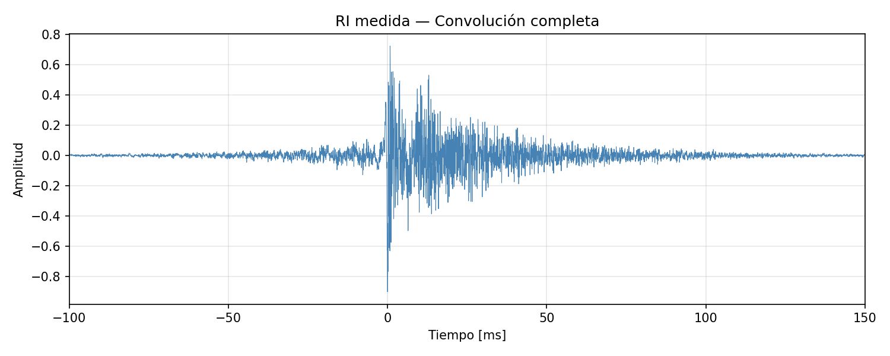

*Figura 3: RI medida, convolución completa sin recorte.*

La figura 4 muestra el criterio para determinar el piso de ruido: se toma el último 10% de la convolución completa (la región sombreada), asumiendo que para ese tramo la reverberación ya decayó por completo y solo queda ruido de fondo de la grabación. Con eso se calcula el RMS del ruido, y el umbral de detección se fija 20 dB por encima de ese valor.

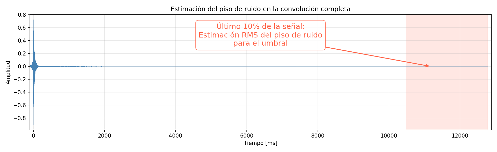

*Figura 4: Estimación del piso de ruido sobre la convolución completa.*

Con ese umbral ya definido, la línea punteada de la figura 5 marca el onset: el instante, retrocediendo desde el pico, a partir del cual la señal supera continuamente el umbral. Ahí es donde se recorta la señal. Todo lo anterior al onset se descarta por considerarse piso de ruido.

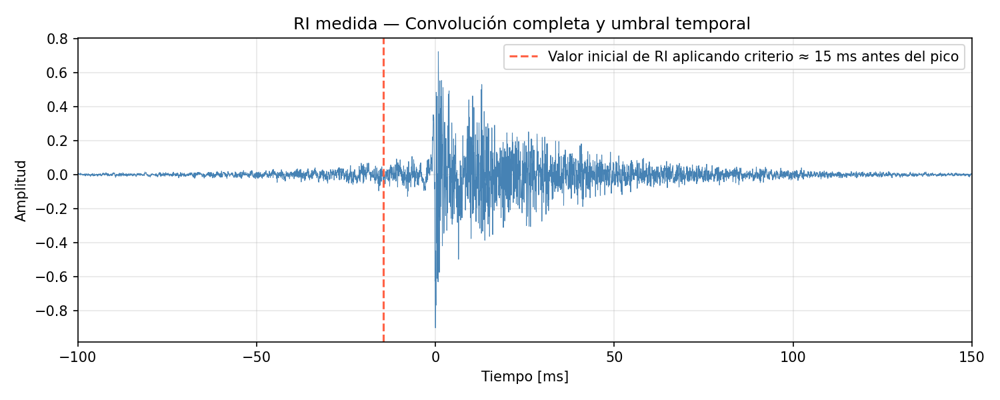

*Figura 5: RI medida con el umbral temporal de recorte (onset).*

La figura 6 muestra cómo queda la señal finalmente devuelta por `obtener_ri_desde_sweep()`, recortada desde el onset, conservando una fracción del ataque de la envolvente, para no perder información de la llegada temprana del sonido directo y normalizada a 0.9 de pico, ya lista para pasar al resto del pipeline de análisis.

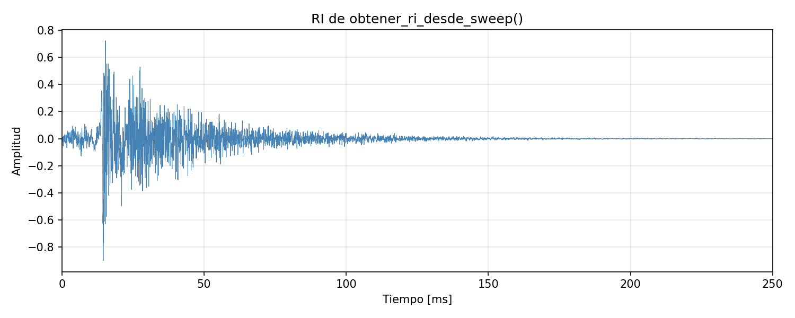

*Figura 6: RI medida, ya procesada por `obtener_ri_desde_sweep`.*

Esta función cuenta con un test que valida el caso de uso completo de punta a punta: genera un sweep y su filtro inverso, define una RI conocida (un tono de 1000 Hz con decaimiento exponencial), simula la grabación convolucionando el sweep con esa RI, y aplica `obtener_ri_desde_sweep()` sobre esa grabación simulada. Como el recorte por onset puede introducir un pequeño desfasaje temporal entre la RI original y la recuperada, la comparación no se hace muestra a muestra sino por correlación cruzada normalizada entre ambas señales, calculada con `correlate` de `scipy.signal`, exigiendo que el pico de correlación supere 0.9, es decir, que la forma de onda recuperada sea prácticamente idéntica a la original, sea cual sea el corrimiento temporal que haya introducido la detección del onset.

### 3.4.5 Cambio de escala: La escala logarítmica

Muchos de los gráficos y funciones del proyecto (la curva de Schroeder, la envolvente de una RI, etc) se entienden mejor en escala logarítmica que en amplitud lineal, porque el oído y los parámetros acústicos de la norma trabajan en dB. Esa conversión la hace `a_escala_log()`, calculando el nivel en decibeles según la ecuación 16:

$$L(t) = 20 \log_{10}\!\left(\frac{|h(t)|}{\max(|h|)}\right) \tag{16}$$

De modo que el pico de la señal siempre quede normalizado a 0 dB y el resto de los valores queden expresados en dB relativos a ese pico.

Antes de calcular el logaritmo, la función le aplica un piso a la relación de amplitudes, de forma que ningún valor caiga por debajo del equivalente a −120 dB. Esto es necesario porque una señal real casi siempre tiene tramos de silencio o valores muy cercanos a cero, y el logaritmo de cero es menos infinito. Aplicar el piso antes del logaritmo, en vez de después, evita ese problema de raíz. Se optó por un piso fijo de −120 dB en lugar de usar el porque −120 dB es un valor con sentido físico, aproximado al límite práctico del rango dinámico de una medición acústica real. También se contempla el caso borde de una señal completamente en silencio, con máximo absoluto igual a cero. En vez de dividir por cero, la función devuelve directamente un array del mismo largo lleno de −120 dB, el piso mínimo, que es la lectura correcta para una señal sin ninguna energía.

Esta función tiene tres tests, todos con señales simples y valores conocidos de antemano para poder verificar el cálculo a mano. Uno confirma que el valor máximo de la señal de entrada efectivamente se traduce en 0 dB en la salida. Otro simplemente chequea que el tipo de retorno sea un array de Numpy. El último es el más significativo desde lo acústico toma una señal con un valor que es exactamente la mitad de otro, y verifica que la diferencia entre ambos en la salida sea de −6 dB.

## 3.5 Milestone 3 — Análisis acústico y API REST

### 3.5.1 Suavizado de señales

A la hora de representar visualmente una respuesta al impulso, los gráficos reales contienen fluctuaciones muy rápidas entre muestras que dificultan visualizar la tendencia de decaimiento. Es por eso que resulta conveniente aplicar un método de suavizado que permita reducir estas fluctuaciones. De eso se encarga `suavizar_signal()`, que admite dos modos de suavizado según el parámetro "ventana".

El modo por defecto, "hilbert", calcula la envolvente instantánea de la señal mediante la transformada de Hilbert de `scipy.signal`, según la ecuación 17:

$$A(t) = \left| x(t) + j\hat{x}(t) \right| \tag{17}$$

Donde $\hat{x}(t)$ es la transformada de Hilbert de la señal original. Este modo es el preferido porque no requiere elegir ningún tamaño de ventana arbitrario, la envolvente sale directamente de la señal analítica. 

No obstante también se optó por otro método. Aceptando un entero como tamaño de ventana, se calcula una media móvil sobre la energía de la señal (la señal al cuadrado), según la ecuación 18:

$$y[n] = \frac{1}{M}\sum_{k=0}^{M-1} x^2[n-k] \tag{18}$$

Donde $M$ es el tamaño de la ventana en muestras. Esta alternativa es más simple de entender, pero requiere elegir manualmente el valor de $M$, algo que la envolvente de Hilbert evita. 

No obstante ambos modos son válidos, y el método de la media móvil puede resultar más conveniente si se busca simplificar mucho más un gráfico para facilitar su entendimiento. Si se desea utilizar la media móvil, basta con seleccionar el tamaño de ventana en la entrada de la función.

Finalmente, esta función cuenta con tres tests. Dos validan el modo Hilbert: uno confirma que la envolvente resultante nunca sea negativa (por ser un valor absoluto, tiene que cumplirse siempre), y otro que la señal suavizada conserve la misma longitud que la señal de entrada. El tercero valida el modo de media móvil, comprobando también que preserve la longitud original.

### 3.5.2 Integral de Schroeder

Tal como se planteó en la ecuación 9 del marco teórico, la curva de decaimiento energético se obtiene sumando, para cada instante $n$, toda la energía restante de la señal desde $n$ hasta el final. Esa es la responsabilidad de `integral_schroeder()`, recibir una RI (idealmente ya filtrada por banda) y devolver la curva de decaimiento en dB, normalizada a 0 dB en su primer valor.

La implementación evita calcular esa suma de forma literal y en cambio aprovecha `np.cumsum` sobre la señal de energía invertida. Al sumar acumulativamente de atrás para adelante sobre la energía invertida da, al revertir el resultado, exactamente la misma suma que pide la ecuación 9, pero con mucho menos procesamiento y menor tiempo de respuesta. Una vez obtenida esa integral, se la convierte a dB normalizando por su primer valor (que es la energía total de la señal), según la ecuación 19:

$$L[n] = 10 \log_{10}\!\left(\frac{E[n]}{E[0]}\right) \tag{19}$$

De modo que la curva siempre arranca en 0 dB, es decir, con toda la energía todavía por delante, y decae a medida que $n$ avanza y hay menos energía remanente. Antes de aplicar el logaritmo se acota el cociente con un piso "EPS" (el épsilon de máquina, es decir, el número más pequeño que puede soportar) para evitar el mismo problema de log10(0) que ya se resolvió en `a_escala_log()`, solo que en este caso no importa que el piso sea demasiado bajo. Como caso borde, si la energía total de la señal es cero (una RI de puro silencio), la función devuelve directamente un array de "-inf" del mismo largo, en vez de dividir por cero.

Esta función cuenta con cuatro tests. Los dos primeros son de forma: que la curva devuelta tenga la misma longitud que la RI de entrada, y que su primer valor sea efectivamente 0 dB. El tercero verifica que la curva sea monótonamente decreciente en toda su extensión, una propiedad que se cumple por construcción matemática (nunca se le puede sumar energía negativa a la integral) y que sirve como chequeo de que la implementación no tenga errores de signo o de indexado. El cuarto es el más relevante desde lo acústico. Se sintetiza una RI con un T60 conocido de antemano, calcula su integral de Schroeder, ajusta una recta por mínimos cuadrados en el rango típico de T30 (−5 a −35 dB), y verifica que el T60 estimado a partir de esa pendiente esté dentro de un 30% del valor real usado para sintetizar la señal, confirmando que la curva no solo decrece, sino que lo hace a la velocidad correcta.

### 3.5.4 Regresión lineal

En `regresion_lineal()` se implementa el método de cuadrados mínimos planteado en el marco teórico (ecuaciones 10 a 13). Recibe dos arrays, típicamente el tiempo y la curva de Schroeder en dB dentro del rango de interés, y devuelve la pendiente $m$, la ordenada al origen $b$ y el coeficiente de determinación $R^2$, calculados exactamente según esas mismas fórmulas.

La implementación contempla dos casos borde que las fórmulas puras no resuelven por sí solas. El primero es cuando el denominador de la ecuación 11 da cero, algo que ocurre si todos los valores de $x$ son iguales entre sí (una recta horizontal). En ese caso no existe una pendiente bien definida, así que la función devuelve pendiente 0, la ordenada como el promedio de $y$, y $R^2 = 0$. El segundo es cuando la varianza total de $y$ (el denominador de la ecuación 13) es cero, es decir, todos los puntos $y$ son idénticos; ahí cualquier recta horizontal ajusta perfectamente, así que se devuelve $R^2 = 1$ en vez de una división por cero.

Vale aclarar que esta función solo calcula el ajuste, no decide si ese ajuste es aceptable. Esa validación se deriva a las siguientes funciones del pipeline.

Esta función tiene tres tests. El primero verifica el caso más simple: una recta perfectamente conocida ($y = 2x + 1$, sin ruido), confirmando que la pendiente y la ordenada recuperadas coincidan con los valores exactos usados para generarla. El segundo confirma que, para datos perfectamente lineales, el $R^2$ calculado sea exactamente 1.0, el máximo posible. El tercero prueba un caso más realista: una recta conocida ($y = 3x + 5$) a la que se le agrega ruido gaussiano, y verifica que la pendiente y la ordenada estimadas sigan estando razonablemente cerca de los valores reales pese al ruido, validando que el método sea robusto a pequeñas perturbaciones, no solo exacto en el caso ideal sin ruido.

### 3.5.5 Método Lundeby

El método Lundeby (Lundeby et al., 1995) es un método para truncar el piso de ruido de la curva de Schroeder. El problema de la integral de Schroeder es que no sabe dónde empieza el ruido, por lo que si se le da una RI de mucha duración, considerará al piso de ruido en la integral y eso resultará posteriormente en un peor ajuste lineal. Para solventar esta carencia, el método Lundeby propone separar al tiempo en bloques de 10 ms (ventanas), hacer una estimación del nivel del piso de ruido utilizando el último 10% de la señal, buscar el primer bloque donde la energía cae dentro de un margen de 10 dB cercanos al piso de ruido, y realizar un ajuste lineal entre el inicio de la curva y ese bloque. Luego, se busca la intersección entre esa recta ajustada y el piso de ruido calculado, y promedia el nivel de la señal luego de esa intersección, para obtener un nuevo nivel de piso de ruido y así repetir todo el proceso nuevamente.  

La función `metodo_lundeby()` implementa este algoritmo llamando directamente a `regresion_lineal()`,definiendo una función auxiliar interna llamada `_primer_cruce_sostenido()`.En vez de tomar como válido el primer bloque que cae por debajo del umbral, esa función auxiliar exige varios bloques consecutivos por debajo del margen de 10 dB, y descarta cualquier candidato dentro de los primeros bloques de la señal, precisamente para no confundir un nulo modal aislado (algo típico en bandas graves como 125 Hz, donde hay poca densidad de modos) con el verdadero comienzo del piso de ruido. A esto se suma otra salvaguarda dentro del bucle principal: cada vez que se reestima el nivel de ruido tras un nuevo truncamiento, ese nuevo valor solo se acepta si no supera en más de 3 dB a la estimación de referencia inicial, evitando que el algoritmo entre en una realimentación positiva donde, iteración tras iteración, el truncamiento se corre cada vez más temprano devorando cola reverberante real en vez de ruido. El proceso se repite hasta que el punto de truncamiento deja de moverse de una iteración a la siguiente, con un tope de 15 iteraciones para garantizar que la función siempre termine.

Se decidió implementar una corrección para respuestas al impulso con una caída inicial rápida seguida de una cola mucho más lenta antes de llegar al verdadero piso de ruido. En ese escenario, el primer cruce sostenido con  el piso de ruido más 10 dB puede tardar muchos segundos en aparecer, y ajustar la recta preliminar sobre todo ese tramo (caída rápida y cola lenta mezcladas) da una pendiente promedio que no representa a ninguna de las dos por separado, extrapolando el truncamiento a un punto intermedio sin sentido físico. Para evitarlo, se acota el tramo usado en esa regresión preliminar a como máximo cuatro veces el tiempo que la señal tarda en caer los primeros 20 dB desde el pico. De esa forma la recta se ajusta únicamente sobre la porción inicial y genuinamente lineal de la caída, sin verse arrastrada por el comportamiento de la cola.

Esta función cuenta con cuatro tests. Uno verifica simplemente los tipos de retorno y que el índice de truncamiento devuelto esté dentro del rango válido de la señal. Otro confirma que, al agregarle ruido de fondo real a una RI sintetizada, el truncamiento efectivamente ocurra antes del final de la señal. Si ocurriese al final, significaría que no se está detectando ruido. Un tercero compara dos versiones de la misma RI, una limpia y otra con ruido agregado, y verifica que la versión ruidosa trunque en un punto más temprano que la limpia, tal como se espera si el algoritmo está reaccionando al ruido y no ignorándolo. El último valida la precisión de la estimación en sí, agrega ruido de fondo con un nivel conocido de antemano y verifica que el nivel de ruido estimado por la función esté dentro de ±6 dB del valor real.

En síntesis, la función recibe como parámetros a la respuesta al impulso y la frecuencia de muestreo, y devuelve una tupla con el índice del truncamiento (como entero) y el nivel de piso de ruido (como flotante).

### 3.5.6 Cálculo de parámetros acústicos 

Esta es la función vital de la API, donde se reúne todo lo desarrollado hasta ahora en Milestone 3. Se trata de `calcular_parametros_acusticos()`, quien recibe como entrada la respuesta al impulso completa, la frecuencia de muestreo y un flag (usar_lundeby), y devuelve un diccionario con EDT, T10, T20, T30, D50, C80 y además la relación señal/ruido (SNR) estimada, cada uno con un valor por banda de octava (125 Hz a 16 kHz).

Para lograrlo, importa y encadena muchas de las funciones descriptas en las secciones anteriores. Primero, por cada banda se filtra la RI completa con `filtro_octava()`, y con esa señal filtrada se decide cómo acotar el tramo útil antes de integrar. Se decidió agregar el flag de  "usar_lundeby" para poder realizar fácilmente comparaciones entre el uso y no uso del método, aunque por defecto está activo. Como se mencionó previamente, se aplica `metodo_lundeby()`, que devuelve tanto el índice de truncamiento como el nivel de piso de ruido estimado; si está desactivado, se conforma con una estimación más simple del ruido usando el último 10% de la señal, sin truncar nada. Con la señal ya acotada, calcula la curva de decaimiento llamando a `integral_schroeder()`, y sobre esa curva ajusta cada tiempo de reverberación con la función auxiliar `_calcular_tiempo()` en los rangos que pide la norma.

En cuanto a la función auxiliar `_calcular_tiempo()`, esta recibe la curva de Schroeder, el vector de tiempo, y el par de límites en dB del rango a ajustar (por ejemplo −5 y −35 para T30). Recorta la curva a ese rango, llama a `regresion_lineal()` sobre esos puntos, y extrapola la pendiente obtenida a −60 dB (`T = -60 / pendiente`) para devolver el tiempo de reverberación correspondiente. También aplica ahí los criterios de validez que quedaron pendientes de `regresion_lineal()`. Si hay menos de dos puntos en el rango, si la pendiente resulta positiva, o si el $R^2$ del ajuste es menor a 0.8, devuelve `None` en vez de un número poco confiable. Se decidió exteriorizar esta función, en vez de repetir esa misma lógica cuatro veces dentro de `calcular_parametros_acusticos()` (una por cada parámetro temporal, que solo difieren en el rango de dB), para no duplicar código y para tener en un único lugar el criterio de qué hace que un ajuste sea aceptable. Si ese criterio cambiara en el futuro (otro umbral de $R^2$, por ejemplo), alcanzaría con modificarlo una sola vez.

D50 y C80, en cambio, no dependen de la curva de Schroeder ni del truncamiento de Lundeby: se calculan comparando directamente la energía de la señal filtrada (`ri_banda` al cuadrado) en distintas ventanas de tiempo, según las ecuaciones 20 y 21:

$$D_{50} = \frac{\sum_{n=0}^{N_{50}} h^2[n]}{\sum_{n=0}^{N-1} h^2[n]} \times 100\% \tag{20}$$

$$C_{80} = 10 \log_{10}\!\left(\frac{\sum_{n=0}^{N_{80}} h^2[n]}{\sum_{n=N_{80}}^{N-1} h^2[n]}\right) \tag{21}$$

donde $N_{50}$ y $N_{80}$ son la cantidad de muestras correspondientes a 50 ms y 80 ms respectivamente. Como D50 es un cociente de energías siempre positivas, nunca puede ser negativo ni superar el 100%; C80 en cambio sí puede ser negativo, si la energía tardía predomina sobre la temprana.

Entre las decisiones de esta función vale mencionar que, si la RI de entrada llega con más de una dimensión, se toma directamente el primer canal antes de cualquier procesamiento, en línea con el mismo criterio de "tomar un canal fijo en vez de mezclar" que se usó en `cargar_audio()`. También se calcula la SNR (relación señal-ruido) por banda, como la diferencia en dB entre el pico de la señal filtrada y el piso de ruido estimado. Ese piso de ruido es el mismo valor que ya se calculó unos pasos antes para decidir el truncamiento con `metodo_lundeby()`. Si "usar_lundeby" está activo (el caso por defecto) se utiliza el mismo valor de SNR que devuelve la función. En caso contrario, se devuelve simplemente la estimación simple del último 10% de la señal. Se decidió incluir este punto porque resulta útil para poder tomar decisiones sobre qué valor de tiempo de reverberación es más apropiado para una medición. Cabe destacar que el valor de SNR también se reporta por banda, como los demás parámetros.

Esta función cuenta con cinco tests. El primero sintetiza una RI con un T60 conocido, y el T30 calculado a 1000 Hz debe caer dentro de un 20% de ese valor real. Otro confirma que D50 siempre quede acotado entre 0% y 100% en todas las bandas, tal como exige su propia definición. Un tercero construye una señal con energía deliberadamente concentrada en los primeros 10 ms y comprueba que su C80 resulte positivo, como corresponde cuando predomina la energía temprana. El cuarto valida la forma de la respuesta, es decir, que el diccionario devuelto contenga las seis claves de parámetros esperadas y que cada una tenga un valor para cada banda de octava. El último repite el test del T30 conocido pero forzando explícitamente `usar_lundeby=True`, confirmando que el camino con truncamiento de Lundeby activo también produzca un resultado válido y no solo el camino más simple sin truncar.

### 3.5.7 Convolución con audio

Como se mencionó en la introducción, además del análisis de parámetros la API ofrece una herramienta de validación subjetiva. Permite aplicarle la reverberación de una RI (medida o sintética) a un audio seco cualquiera, para poder escuchar el resultado. De eso se encarga `convolucionar()`, que recibe el audio seco, la RI, y la frecuencia de muestreo de cada uno por separado, y devuelve el audio ya convolucionado.

El problema con el que se enfrenta esta función es de índole práctico. Al utilizar una RI y un audio de distintas fuentes, es altamente probable que cada uno contenga una frecuencia de muestreo diferente. Por ello, si las frecuencias de muestreo difirieran, convolucionar directamente daría un resultado con el tono y la duración incorrectos. Para evitarlo, si las frecuencias no coinciden, uno de los dos audios debe resamplearse a la frecuencia del otro. Se decidió resamplear la RI a la frecuencia del audio dado que el audio contiene información más valiosa para rescatar entre sus muestras que la RI, de quien solo se toma la tendencia de decaimiento para modificar la escucha del audio original. En otras palabras, resulta mucho más valiosa la información del audio a escuchar que la RI de la cual se quiere adicionar un poco de información.

Para realizar el resampleo se utilizó `resample_poly()` de `scipy.signal`. En términos simples, esta función cambia la cantidad de muestras por segundo de una señal, insertando o descartando muestras según haga falta. No obstante, la función `resample_poly(RI, f_up, f_down)` no recibe directamente las dos frecuencias de muestreo, sino una relación de enteros "f_up/f_down" que indica en qué proporción cambiar la cantidad de muestras. Para obtener cada una primero se calcula el máximo común divisor de ambas frecuencias de muestreo y luego se dividie a las frecuencias de muestreos por ese valor. En el caso de "f_up" se toma como numerador la frecuencia del audio, y viceversa. Esto garantiza que la relación entre "f_up" y "f_down" sea la fracción más simple posible, dando como resultado un número natural. 

Luego de realizar el resampleo se procede a realizar la convolución. Una vez más el corazón de la función es `fftconvolve()` de `scipy.signal` (en modo "full para conservar todo el audio). Tal como se mencionó en el caso del sine sweep, esta herramienta resulta mucho más eficiente que realizar una convolución directa. 

Al final, el resultado de la convolución decidió normalizarse a 0.9 de pico para dejar un margen antes del clipeo, y se castea explícitamente a float32. Se decidió usar este formato, a diferencia del float64, que usa el resto del proyecto, porque esta señal está pensada únicamente para exportarse como WAV y reproducirse, no para seguir siendo analizada matemáticamente. En este contexto float32 ya tiene sobrada precisión para eso y ocupa la mitad de espacio.

Esta función cuenta con seis tests. Uno verifica que la longitud de la salida sea exactamente la que corresponde a una convolución, es decir, que la cantidad de muestras totales se la suma de las individuales menos 1. Otro confirma que el pico de la salida quede normalizado a 0.9. Un tercero chequea que el tipo de dato de salida sea efectivamente float32, aunque las entradas se pasen como float64. Otro valida un caso trivial pero importante: si el audio de entrada es silencio absoluto, la salida también debe ser silencio absoluto (nada de ruido numérico introducido por la convolución). Los dos últimos cubren el resampleo: uno verifica que, con frecuencias de muestreo distintas entre audio y RI, la longitud de la salida sea coherente con la RI ya resampleada al fs del audio; mientras que el otro confirma el caso contrario, que si ambas frecuencias coinciden no se aplique ningún resampleo y la longitud de salida sea exactamente la esperada sin ninguna corrección de por medio.

## 3.6 API REST

La API expone toda la funcionalidad como endpoints HTTP, resumidos en la Tabla 3:

| Endpoint | Método | Función | Respuesta |
|----------|:------:|---------|:---------:|
| `/health` | GET | Health check | JSON |
| `/api/v1/signals/pink-noise` | POST | Genera ruido rosa | WAV |
| `/api/v1/signals/sine-sweep` | POST | Genera sine sweep | WAV |
| `/api/v1/signals/sine-sweep-pair` | POST | Sweep + filtro inverso | ZIP (2 WAV) |
| `/api/v1/signals/synthetic-ir` | POST | Genera RI sintética | WAV |
| `/api/v1/filters/frequencies` | GET | Lista frecuencias centrales disponibles | JSON |
| `/api/v1/filters/band` | POST | Filtra audio por banda | WAV |
| `/api/v1/acoustics/parameters` | POST | EDT/T10/T20/T30/D50/C80 por banda | JSON |
| `/api/v1/acoustics/parameters/by-bands` | POST | Mismo resultado organizado por frecuencia | JSON |
| `/api/v1/analysis/impulse-response` | POST | Análisis completo de RI | JSON |
| `/api/v1/utils/schroeder` | POST | Curva de Schroeder | JSON |
| `/api/v1/utils/smoothing` | POST | Envolvente suavizada | JSON |
| `/api/v1/utils/log-scale` | POST | Señal en dB | JSON |
| `/api/v1/convolution/with-ir` | POST | Convoluciona audio con una RI subida | WAV |
| `/api/v1/convolution/with-synthetic-ir` | POST | Convoluciona audio con una RI sintética | WAV |

*Tabla 3: Endpoints de la API REST, su función y su respuesta.*

Cada endpoint se implementa como una función "async" de FastAPI, decorada con "@router.post" o "@router.get", dentro de un router dedicado por dominio:

- `signals.py` — Generación de señales (ruido rosa, sine sweep, RI sintética).
- `filters.py` — Filtrado por banda de octava.
- `acoustics.py` — Cálculo de parámetros acústicos ISO 3382.
- `analysis.py` — Análisis completo de una RI (parámetros y curvas por banda en un solo endpoint).
- `utils.py` — Utilidades sueltas de análisis (Schroeder, suavizado, escala log).
- `convolution.py` — la herramienta de convolución de audio con una RI.

Cada uno de esos routers se registra en `app/main.py` mediante `app.include_router()`, agregándole un prefijo común (`/api/v1/<dominio>`) y una etiqueta, que es lo que después Swagger usa para agrupar los endpoints en la documentación automática de `/docs`.

Esta separación por router respeta la misma arquitectura de tres capas que se explicó al principio del desarrollo experimental. El router solo se encarga de recibir la petición HTTP, invocar a la función de servicio correspondiente y traducir su resultado o sus excepciones a una respuesta HTTP. 

Los endpoints que solo necesitan parámetros numéricos (como generar ruido rosa o un sine sweep) reciben un cuerpo JSON validado contra un schema de Pydantic, con rangos definidos. Si un valor queda fuera de rango, FastAPI devuelve automáticamente un error 422 sin que el código del router tenga que chequear nada a mano. Los endpoints que en cambio necesitan un archivo de audio reciben un "UploadFile" vía `multipart/form-data`, leen sus bytes y los envuelven en un "io.BytesIO" para poder pasárselos directamente a `cargar_audio()` sin escribir nada a disco, tal como se explicó al hablar de objetos file-like cuando se desarrolló la función. Los que devuelven audio en vez de JSON, lo hacen empaquetando la señal en un WAV en memoria con `soundfile.write()` sobre otro "BytesIO", envuelto en un StreamingResponse con `media_type="audio/wav"`. Ese "media_type" es solo una etiqueta que le dice al programa que recibe la respuesta HTTP qué tipo de contenido le está llegando, para que sepa interpretarlo.

Los schemas de Pydantic mencionados viven en "app/schemas/", separados en dos archivos según para qué lado de la petición sirven. Por un lado, `signals.py` define los schemas de entrada, "PinkNoiseRequest" y "SineSweepRequest", usados por los dos únicos endpoints cuya entrada es enteramente JSON (duración, frecuencias, fs). Son clases que heredan de la librería `pydantic.BaseModel`, donde cada campo se declara con el valor por defecto, el rango válido (mínimo y máximo), y una descripción en texto que después FastAPI reutiliza automáticamente para armar la documentación interactiva en `/docs`. El resto de los endpoints, que reciben un archivo de audio, no usan un schema de este tipo para su entrada, porque un "UploadFile" no es algo que el BaseModel común pueda representar directamente como campo, así que esos parámetros (el archivo, y algún dato adicional como la frecuencia central en el filtrado por banda) se declaran sueltos en la firma de la función con `File(...)` y `Form(...)`, en vez de agruparse en una clase.

Sobre el manejo de errores, cada router distingue tres situaciones bien delimitadas. Primero, un archivo de audio que no se puede leer o decodificar se traduce en un 422 (error de validación de la entrada). Segundo, una condición de dominio que sí se pudo leer pero no tiene sentido para el cálculo, como por ejemplo una RI demasiado corta, una frecuencia de inicio de barrido mayor que la del final del barrido, etc. Estas situaciones se traducen en un error 400. Finalmente cualquier excepción inesperada durante el cálculo en sí se traduce en un error 500 con el mensaje de la excepción original.

No obstante, la compresión de esta sección de la API fue muy limitada y resuelta mayormente por el uso de asistentes virtuales.

---

## 4. Resultados

### 4.1 Resultados de validación de generación de señales

A continuación se proporcionan diversas gráficas que permiten visualizar los resultados obtenidos para la generación de señales. Los gráficos de PSD y convolución se generaron con `docs/m1/scripts/generar_graficos.py`; los espectrogramas y el análisis espectral se generaron exportando las señales a WAV y analizándolas en Audacity.

La figura 7 muestra la pendiente medida con Welch sobre 10 segundos de señal: −3.01 dB/oct, prácticamente coincidente con el valor teórico (la línea roja discontinua). El test automatizado exige que esa pendiente esté dentro del rango −4 a −2 dB/oct, criterio que esta implementación supera con amplitud.

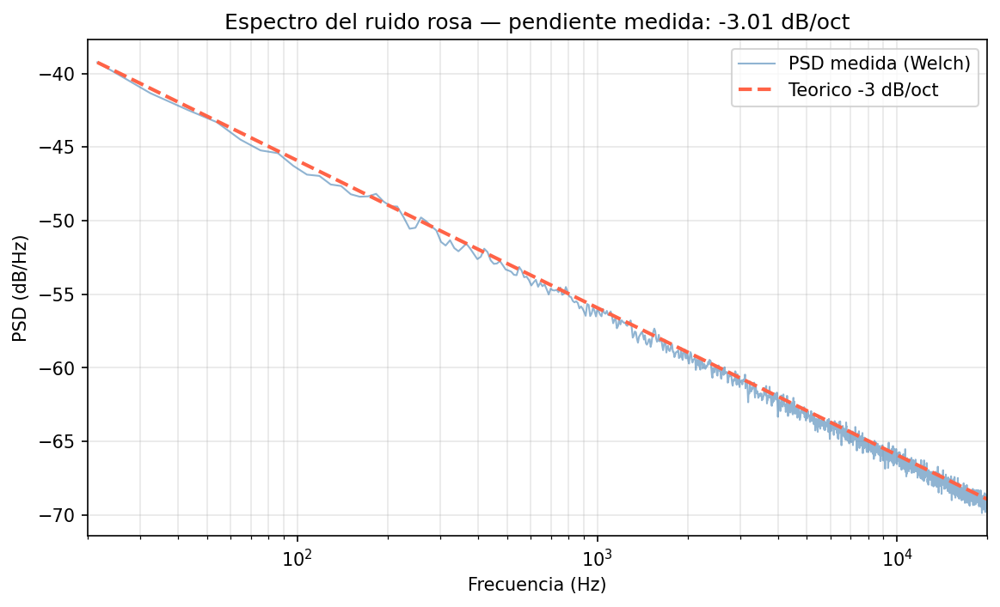

*Figura 7: Densidad espectral de potencia del ruido rosa, medida con el método de Welch, contra la referencia teórica de −3 dB/oct.*

La figura 8 confirma visualmente, desde una herramienta externa al proyecto, la misma caída progresiva de nivel a medida que aumenta la frecuencia, con una envolvente espectral consistente con −3 dB/oct en toda la banda audible.


*Figura 8: Análisis espectral del ruido rosa en Audacity.*

En la figura 9, como un detalle adicional, se proporciona el espectograma del ruido rosa analizado en Audacity, desde el cual puede apreciarse que la densidad de color es aproximadamente uniforme en toda la banda y a lo largo del tiempo. Esta es precisamente la característica del ruido rosa, donde se tiene igual energía por octava, sin preferencia temporal ni espectral, a diferencia de un ruido blanco que se vería más brillante en las frecuencias altas.


*Figura 9: Espectrograma del ruido rosa en Audacity.*

La figura 10 muestra el comportamiento característico del sweep logarítmico en el dominio temporal, donde la frecuencia instantánea crece lentamente al principio y se acelera hacia el final (ciclos tan comprimidos que la señal parece sólida a la derecha).

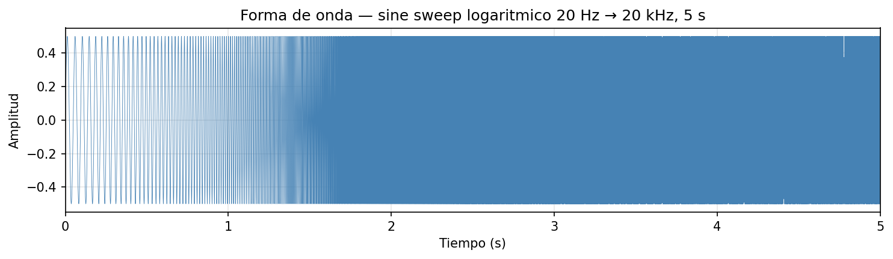

*Figura 10: Forma de onda del sine sweep logarítmico.*

Respecto a su crecimiento frecuencial, resulta más interesante analizar este tipo de señales en un espectograma como el de la figura 11, confirmando que la frecuencia instantánea crece de forma monótonamente creciente de 20 Hz a 20 kHz a lo largo de los 5 segundos del barrido, describiendo una trayectoria exponencial sin discontinuidades ni saltos de frecuencia. El fondo negro representa que el nivel en esas frecuencias, en ese instante de tiempo es mucho más bajo.


*Figura 11: Espectrograma del sine sweep en Audacity.*

Como plantea la ecuación 5 del marco teórico, la convolución del sweep senoidal con su filtro inverso debe aproximarse a una delta de Dirac. La figura 12 ilustra que, efectivamente, toda la energía de la señal resultante queda concentrada en un único instante, con el resto de la señal prácticamente en cero.

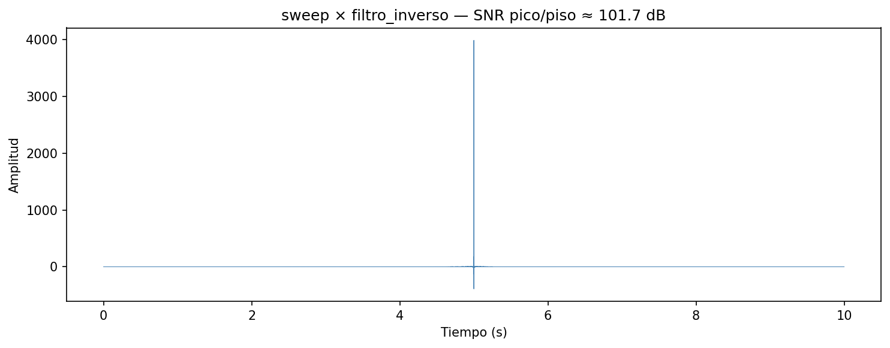

*Figura 12: Convolución del sweep con su filtro inverso, vista completa.*

Al hacer zoom sobre ese pico (figura 13) se ve un pulso estrecho con lóbulos laterales mínimos, esto se da de esta manera puesto que el impulso ideal es imposible de obtener. No obstante la aproximación práctica al impulso ideal tuvo una relación señal a ruido pico/piso medida de aproximadamente 102 dB, muy por encima del umbral mínimo de 40 dB que exige el test de la función de generación del sine sweep y el filtro inverso. De esta manera, se garantiza que la deconvolución de un sweep grabado con la función de generación de la API producirá una RI con alta resolución y bajo nivel de distorsiones.

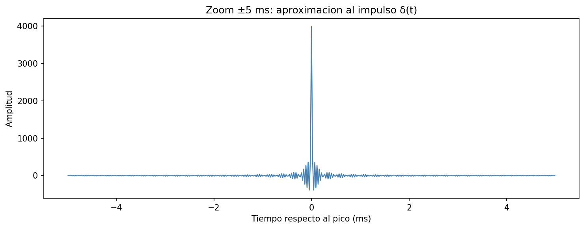

*Figura 13: Zoom sobre el pico de la convolución entre el sweep y su filtro inverso.*

En síntesis, todas las herramientas de generación de señales garantizan su excelente funcionamiento. 

### 4.2 Resultados de validación del procesamiento de respuestas al impulso

Para validar el procesamiento de las respuestas al impulso, se descargaron dos RIs reales de OpenAir, correspondientes a Elveden Hall (Suffolk, Inglaterra) y Maes Howe (Orkney, Escocia). El primero de estos recintos se trata de una sala grande, con valores de T60 relativamente altos, mientras que el segundo es un monumento de enterramiento de la era neolítica, tratándose de cavernas de muy poco tamaño, es decir, un recinto pequeño con un valor de T60 mucho menor. Finalmente, también se midió la respuesta al impulso del recinto de uno de los autores de este proyecto, usando el script `docs/m2/scripts/medir_ri.py`,a modo de inspeccionar y validar también la generación del sine sweep, la reproducción/grabación y la deconvolución de punta a punta con un hardware real. 

Las figuras 14 y 15 muestran, para cada RI real cargada con `cargar_audio()`, la envolvente de Hilbert de la señal ya filtrada en la banda de 1000 Hz. En la figura 14 se observa la RI filtrada de Elveden Hall, con un decaimiento exponencialmente progresivo durante unos 2 segundos.

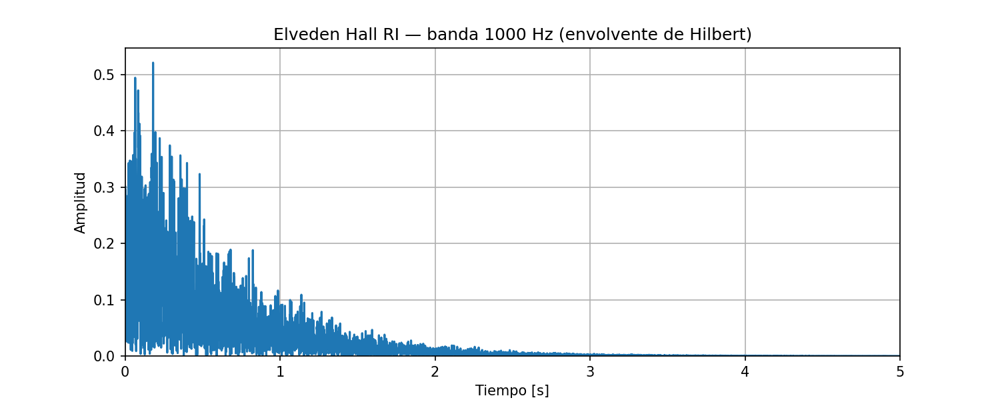

*Figura 14: Envolvente de Hilbert de la RI de Elveden Hall, filtrada en la banda de 1000 Hz (fuente de la RI: OpenAIR).*

En contraste, la figura 15 muestra un decaimiento considerablemente más rápido en la misma banda. Esto es un síntoma de que el recinto es mucho más pequeño y absorbente que el anterior, donde prácticamente las reflexiones se extinguen luego del impulso.

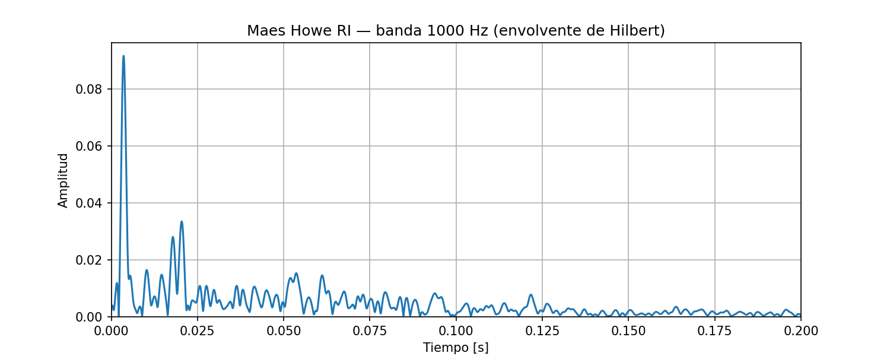

*Figura 15: Envolvente de Hilbert de la RI de Maes Howe, filtrada en la banda de 1000 Hz (fuente de la RI: OpenAIR).*

En la figura 16 se contrasta a las anteriores RI con la medición realizada con el software, visualizando también la envolvente de Hilbert en la banda de 1000 Hz. En este caso se observa un comportamiento intermedio al de los anteriores recintos. 

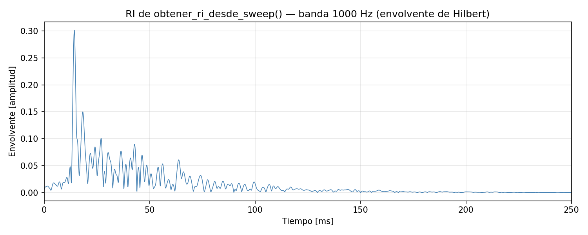

*Figura 16: Envolvente de Hilbert de la RI medida (propia), filtrada en la banda de 1000 Hz.*

La figura 17 verifica el correcto funcionamiento de `filtro_octava()`. La línea horizontal punteada marca el nivel de −3 dB en el cual se intersectan las curvas de crecimiento y decrecimiento del filtro en cada banda. Se observa que cada filtro alcanza su máximo (0 dB) en la frecuencia central nominal, también que el filtro se mantiene muy plano dentro de su banda (característica de Butterworth), que la ganancia efectivamente es de esos −3 dB en las frecuencias de corte teóricas, que las bandas no se solapan ni dejen huecos significativos entre si, y que el decaimiento fuera de la banda supera los 20 dB por octava, garantizando buena separación entre bandas vecinas.

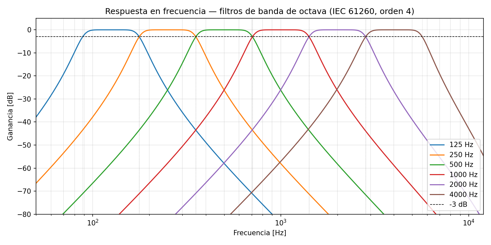

*Figura 17: Respuesta en frecuencia de los filtros de octava.*

Puede visualizarse entonces que las herramientas de procesamiento de RIs obtienen resultados esperables, validando su funcionamiento.

### 4.3 Validación M3 — Parámetros acústicos

La validación de la RI sintética con T60 conocido ya se describió al presentar los tests de `calcular_parametros_acusticos()`, donde se pedía que el T30 calculado sobre una RI sintetizada con T60 = 2.0 s caiga dentro de un 20% del valor real. Esta sección se enfoca en contrastar los parámetros calculados por la API contra REW (Room EQ Wizard), el software de referencia de la industria, usando RIs reales en vez de sintéticas.

Se usaron las tres RIs previamente mencionadas: Elveden Hall, Maes Howe y la RI propia medida con `medir_ri.py`. Para cada una, se cargó el WAV en REW, se midió el tiempo de reverberación con filtro Zero Phase por octava, se exportó la tabla de resultados, y se comparó contra `calcular_parametros_acusticos()`. Además de EDT, T20 y T30, las tablas también incluyen la comparación de C80 y D50 contra REW.

Antes de comparar los tiempos de reverberación, conviene visualizar la curva de Schroeder de cada RI junto con el truncamiento de Lundeby y las rectas de ajuste de T20 y T30, para entender de dónde sale cada número de la comparación.

La figura 18 muestra el caso de Elveden Hall: al ser una sala grande con alta densidad modal, la curva es prácticamente recta hasta el punto de truncamiento, y las rectas de T20 y T30 casi se superponen entre sí y con la curva medida.

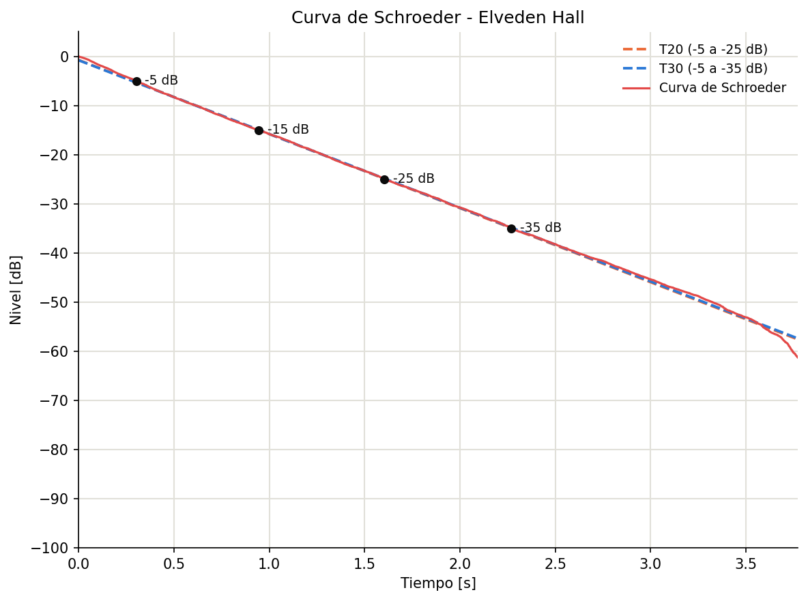

*Figura 18: Curva de Schroeder, truncamiento de Lundeby y ajuste T20/T30 — Elveden Hall.*

En la figura 19, la curva de Maes Howe muestra una curvatura visible antes del truncamiento, se dobla hacia una pendiente más suave a partir de los −45/−50 dB. Es consistente con el ruido de fondo real de la medición y con la baja densidad modal de un recinto tan pequeño en frecuencias bajas, que es exactamente el motivo por el que Lundeby trunca antes de que esa curvatura contamine la regresión.

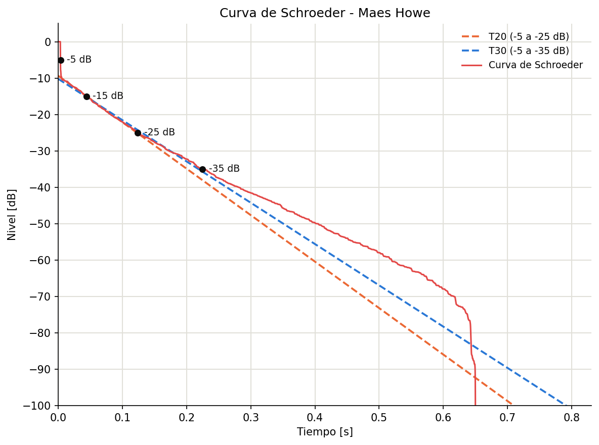

*Figura 19: Curva de Schroeder, truncamiento de Lundeby y ajuste T20/T30 — Maes Howe.*

La figura 20 muestra el mismo comportamiento en la RI medida propia: la curva se aplana notoriamente después de los −40 dB antes de truncar, reflejando el piso de ruido real del entorno de grabación, a diferencia de una cámara anecoica o un recinto muy silencioso.

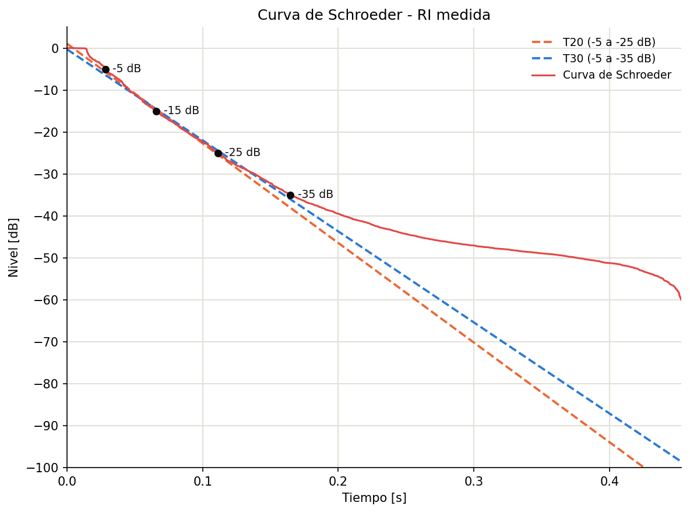

*Figura 20: Curva de Schroeder, truncamiento de Lundeby y ajuste T20/T30 — RI medida (propia).*

Con esas curvas ya validadas visualmente, las figuras 21 a 23 comparan directamente el T30 calculado por banda de octava entre RIR-API y REW.

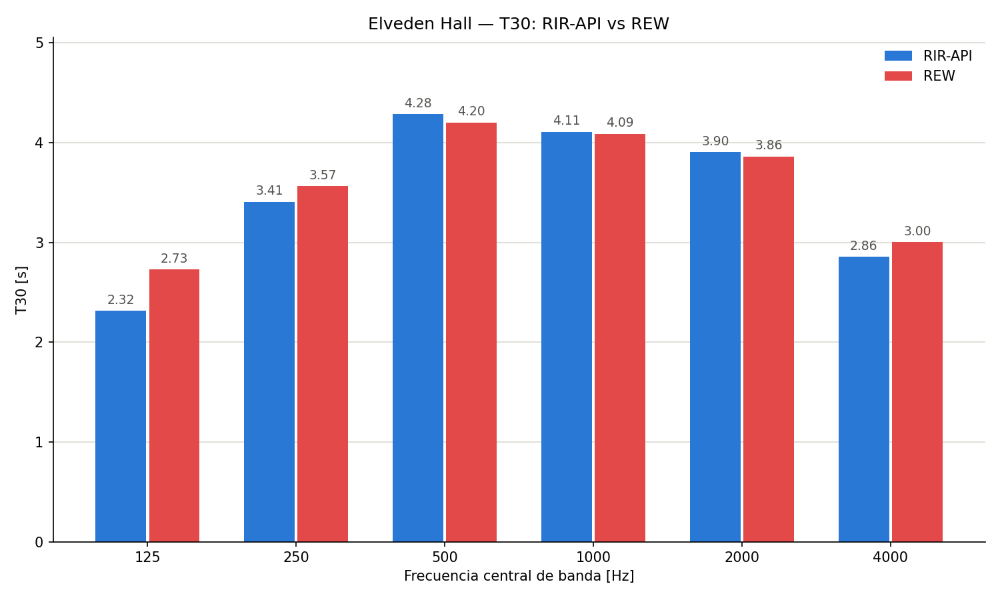

*Figura 21: Comparación de T30 por banda, RIR-API vs REW — Elveden Hall.*

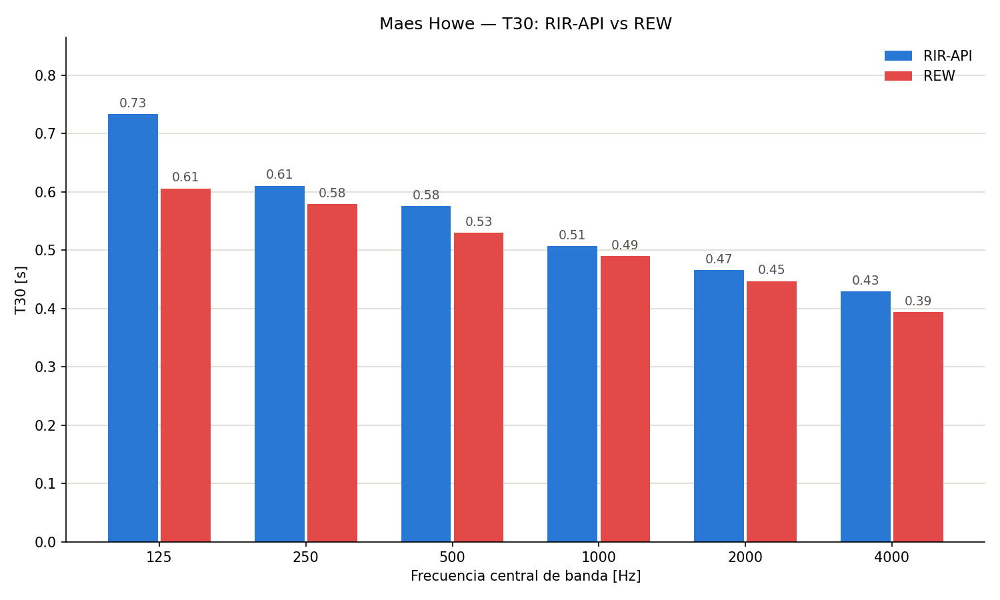

*Figura 22: Comparación de T30 por banda, RIR-API vs REW — Maes Howe.*

En las  figuras 21 y 22, se observa que la banda de 125 Hz muestra la mayor divergencia, siendo 0,413 s de diferencia en el caso de Elveden Hall y 0,167 s en el de Maes Howe. Se sospecha que esto es debido a una particularidad de las respuestas al impulso seleccionadas, puesto que al comparar los valores obtenidos en REW también hay mucha diferencia con los informados en OpenAIR. Esto podría ser causado por la baja densidad modal a bajas frecuencias en recintos chicos, que hace que el resultado sea más sensible a diferencias finas entre el filtro de octava de RIR-API y el de REW. Aun así, ambos casos quedan dentro de una tolerancia de ±0.5 s.  

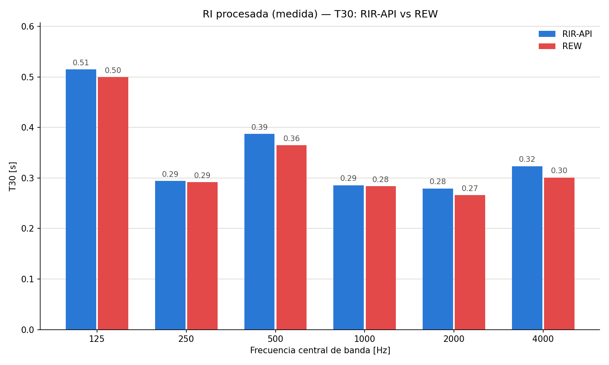

*Figura 23: comparación de T30 por banda, RIR-API vs REW — RI procesada (medida).*

Las Tablas 4, 5 y 6 muestran el detalle completo por banda (125 a 4000 Hz) de EDT, T20, T30, C80 y D50 para las tres RIs. La tolerancia considerada en los parámetros temporales es de ±0.5 s. Mientras que para el C80 se toma un parámetro aceptable de ±1 dB.


| Parámetro | Banda (Hz) | RIR-API | REW | Diferencia | Dentro de tolerancia |
|---|---|---|---|---|---|
| EDT | 125 | 2.125s | 2.212s | -0.087s | Sí |
| EDT | 250 | 3.280s | 3.384s | -0.104s | Sí |
| EDT | 500 | 4.490s | 4.416s | +0.074s | Sí |
| EDT | 1000 | 3.939s | 3.957s | -0.018s | Sí |
| EDT | 2000 | 3.665s | 3.650s | +0.015s | Sí |
| EDT | 4000 | 2.578s | 2.652s | -0.074s | Sí |
| T20 | 125 | 2.367s | 2.627s | -0.260s | Sí |
| T20 | 250 | 3.482s | 3.605s | -0.123s | Sí |
| T20 | 500 | 4.275s | 4.255s | +0.020s | Sí |
| T20 | 1000 | 4.123s | 4.119s | +0.004s | Sí |
| T20 | 2000 | 3.842s | 3.859s | -0.017s | Sí |
| T20 | 4000 | 2.765s | 2.903s | -0.138s | Sí |
| T30 | 125 | 2.250s | 2.650s | -0.400s | Sí |
| T30 | 250 | 3.454s | 3.567s | -0.113s | Sí |
| T30 | 500 | 4.194s | 4.202s | -0.008s | Sí |
| T30 | 1000 | 4.088s | 4.089s | -0.001s | Sí |
| T30 | 2000 | 3.843s | 3.862s | -0.019s | Sí |
| T30 | 4000 | 2.836s | 3.001s | -0.165s | Sí |
| C80 | 125 | -1.07dB | -0.74dB | -0.33dB | Sí |
| C80 | 250 | -6.80dB | -5.65dB | -1.15dB | No |
| C80 | 500 | -4.76dB | -5.06dB | +0.30dB | Sí |
| C80 | 1000 | -6.89dB | -6.83dB | -0.06dB | Sí |
| C80 | 2000 | -5.72dB | -5.55dB | -0.17dB | Sí |
| C80 | 4000 | -2.79dB | -2.98dB | +0.19dB | Sí |
| D50 | 125 | 31.2% | 32.6% | -1.4pp | — |
| D50 | 250 | 8.6% | 12.1% | -3.5pp | — |
| D50 | 500 | 15.6% | 14.6% | +1.0pp | — |
| D50 | 1000 | 9.6% | 9.8% | -0.2pp | — |
| D50 | 2000 | 11.1% | 11.7% | -0.6pp | — |
| D50 | 4000 | 20.3% | 19.7% | +0.6pp | — |

*Tabla 4: EDT, T20, T30, C80 y D50 por banda de octava, RIR-API vs REW — Elveden Hall.*

| Parámetro | Banda (Hz) | RIR-API | REW | Diferencia | Dentro de tolerancia |
|---|---|---|---|---|---|
| EDT | 125 | 0.709s | 0.596s | +0.113s | Sí |
| EDT | 250 | 0.451s | 0.535s | -0.084s | Sí |
| EDT | 500 | 0.331s | 0.402s | -0.071s | Sí |
| EDT | 1000 | 0.463s | 0.252s | +0.211s | Sí |
| EDT | 2000 | 0.364s | 0.301s | +0.063s | Sí |
| EDT | 4000 | N/A | N/A | - | - |
| T20 | 125 | 0.751s | 0.610s | +0.141s | Sí |
| T20 | 250 | 0.605s | 0.550s | +0.055s | Sí |
| T20 | 500 | 0.615s | 0.507s | +0.108s | Sí |
| T20 | 1000 | 0.513s | 0.492s | +0.021s | Sí |
| T20 | 2000 | 0.432s | 0.433s | -0.001s | Sí |
| T20 | 4000 | 0.415s | 0.382s | +0.033s | Sí |
| T30 | 125 | 0.773s | 0.606s | +0.167s | Sí |
| T30 | 250 | 0.628s | 0.579s | +0.049s | Sí |
| T30 | 500 | 0.606s | 0.530s | +0.076s | Sí |
| T30 | 1000 | 0.508s | 0.490s | +0.018s | Sí |
| T30 | 2000 | 0.462s | 0.447s | +0.015s | Sí |
| T30 | 4000 | 0.420s | 0.394s | +0.026s | Sí |
| C80 | 125 | 7.52dB | 8.21dB | -0.69dB | Sí |
| C80 | 250 | 10.50dB | 11.39dB | -0.89dB | Sí |
| C80 | 500 | 13.22dB | 13.87dB | -0.65dB | Sí |
| C80 | 1000 | 12.58dB | 16.64dB | -4.06dB | No |
| C80 | 2000 | 14.72dB | 17.95dB | -3.23dB | No |
| C80 | 4000 | 18.86dB | 22.63dB | -3.77dB | No |
| D50 | 125 | 70.0% | 80.5% | -10.5pp | — |
| D50 | 250 | 81.7% | 84.7% | -3.0pp | — |
| D50 | 500 | 89.8% | 90.2% | -0.4pp | — |
| D50 | 1000 | 85.2% | 95.0% | -9.8pp | — |
| D50 | 2000 | 91.7% | 96.2% | -4.5pp | — |
| D50 | 4000 | 97.0% | 98.5% | -1.5pp | — |

N/A significa "no disponible"(not available). Esto es porque ninguno de los dos softwares pudo calcular EDT en esa banda. En el caso de la API, el ajuste en esa banda era muy malo, por lo que la API omitió reportar ese valor. Esto se debe probablemente a que se trata de una sala muy chica y a frecuencias suficientemente altes las primeras reflexiones llegan muy rápido y con mucha variabilidad entre sí. 

*Tabla 5: EDT, T20, T30, C80 y D50 por banda de octava, RIR-API vs REW — Maes Howe.*

| Parámetro | Banda (Hz) | RIR-API | REW | Diferencia | Dentro de tolerancia |
|---|---|---|---|---|---|
| EDT | 125 | 0.184s | 0.190s | -0.006s | Sí |
| EDT | 250 | 0.154s | 0.135s | +0.019s | Sí |
| EDT | 500 | 0.183s | 0.166s | +0.017s | Sí |
| EDT | 1000 | 0.270s | 0.248s | +0.022s | Sí |
| EDT | 2000 | 0.248s | 0.219s | +0.029s | Sí |
| EDT | 4000 | 0.263s | 0.237s | +0.026s | Sí |
| T20 | 125 | 0.277s | 0.279s | -0.002s | Sí |
| T20 | 250 | 0.313s | 0.292s | +0.021s | Sí |
| T20 | 500 | 0.286s | 0.294s | -0.008s | Sí |
| T20 | 1000 | 0.269s | 0.271s | -0.002s | Sí |
| T20 | 2000 | 0.231s | 0.232s | -0.001s | Sí |
| T20 | 4000 | 0.250s | 0.252s | -0.002s | Sí |
| T30 | 125 | 0.514s | 0.500s | +0.015s | Sí |
| T30 | 250 | 0.294s | 0.292s | +0.003s | Sí |
| T30 | 500 | 0.380s | 0.365s | +0.015s | Sí |
| T30 | 1000 | 0.282s | 0.284s | -0.002s | Sí |
| T30 | 2000 | 0.267s | 0.266s | +0.001s | Sí |
| T30 | 4000 | 0.292s | 0.301s | -0.009s | Sí |
| C80 | 125 | 21.35dB | 22.26dB | -0.91dB | Sí |
| C80 | 250 | 21.88dB | 23.97dB | -2.09dB | No |
| C80 | 500 | 19.85dB | 20.67dB | -0.82dB | Sí |
| C80 | 1000 | 16.95dB | 18.41dB | -1.46dB | No |
| C80 | 2000 | 19.04dB | 21.03dB | -1.99dB | No |
| C80 | 4000 | 17.97dB | 18.90dB | -0.93dB | Sí |
| D50 | 125 | 96.2% | 97.2% | -1.0pp | — |
| D50 | 250 | 98.3% | 98.7% | -0.4pp | — |
| D50 | 500 | 95.7% | 97.7% | -2.0pp | — |
| D50 | 1000 | 90.2% | 93.5% | -3.3pp | — |
| D50 | 2000 | 93.2% | 95.7% | -2.5pp | — |
| D50 | 4000 | 90.6% | 93.8% | -3.2pp | — |

*Tabla 6: EDT, T20, T30, C80 y D50 por banda de octava, RIR-API vs REW — RI procesada (medida).*

Como se puede apreciar, EDT, T20 y T30 quedan dentro del rango de tolerancia en las tres RIs. En cambio, para C80 se y D50 se observa que hay valores con una mayor desviación. Las causas de estas desviaciones aún se están investigando, pero por el momento no se tienen hipótesis.

### 4.4 Tests automatizados

Todos los tests han pasado exitosamente, lo cual es un gran indicio del buen funcionamiento de la API. A su vez, el CI de github también se encuentra validado.

---

## 5. Conclusiones

El sistema RIR-API logra implementar de forma completa todo el flujo de trabajo de medición y análisis acústico según la norma ISO 3382, desde la generación de señales de excitación hasta el cálculo de parámetros acústicos por banda de octava. El trabajo ha resultado un gran desafío para sus integrantes puesto a que el contacto con las herramientas de programación e informática se encontraba inicialmente muy lejos del alcance de este proyecto. 

La etapa de generación de señales y procesamiento de RI demostró resultados impecables, respaldados por gráficos que permiten la correcta visualización del funcionamiento de cada servicio.  En cuanto al análisis acústico, la API cumple con la tolerancia buscada frente a los parámetros acústicos temporales respecto a la comparación con el software comercial REW, mientras que los parámetros D50 y C80 presentan mayores desviaciones. Las causas de la desviaciones de estos parámetros aún se están investigando.

No obstante, aunque las diferencias cumplían con la tolerancia, se observó una mayor desviación en las comparaciones con REW en las bandas de 125 Hz para algunas de las RIs descargadas de OpenAIR. Mientras que para la RI medida, los parámetros difieren en muy poco margen. Una hipótesis sobre este asunto es que se deba a alguna característica modal en las respuestas al impulso seleccionadas, que sea muy sensible a alguna diferencia de filtros entre RIR-API y REW. Por otro lado, la API se comportaba perfectamente a la hora de analizar las diferencias con una RI sintetizada, detalle que brinda una validación al software. De todas formas, las fluctuaciones en esa banda deberán ser inspeccionadas y debe repetirse el proceso con diferentes respuestas al impulso para descartar posibles fallas en el algoritmo.

Dentro de las limitaciones a destacar está el hecho de que solo se soportan archivos en formato WAV/FLAC, y aunque se acepten formatos estéreo, se termina descartando uno de los canales para realizar todo el procesamiento en uno de ellos. En el futuro se implementará un algoritmo que permita entregar la informaión de cada canal procesada por separado, de modo de no despreciar toda la información aportada en la medición de una RI, junto con un soporte multicanal para mediciones "B-format" de acústica espacial. Por otro lado, otra de las limitaciones actuales del proyecto es el hecho de que solo se permite realizar filtrados por bandas de octava. En el futuro se buscará ampliar este campo incluyendo un filtro de tercio de octava, seleccionable como un servicio aparte.

Finalmente, otro de los aspectos posibles que pueden explotarse es el hecho de implementar el cálculo de piso de ruido del algoritmo lundeby para calcular el onset en la función que obtiene la respuesta al impulso desde el sweep, hecho que no se consideró inicialmente puesto que el desarrollo de la función de deconvolución fue previo a Lundeby.

---

## 6. Referencias

- ISO 3382-1:2009. *Acoustics — Measurement of room acoustic parameters — Part 1: Performance spaces.* International Organization for Standardization.
- IEC 61260-1:2014. *Electroacoustics — Octave-band and fractional-octave-band filters — Part 1: Specifications.* International Electrotechnical Commission.
- Farina, A. (2000). *Simultaneous measurement of impulse response and distortion with a swept-sine technique.* 108th AES Convention, Paris.
- Schroeder, M. R. (1965). New method of measuring reverberation time. *Journal of the Acoustical Society of America*, 37(3), 409–412.
- Lundeby, A., Vigran, T. E., Bietz, H., & Vorländer, M. (1995). Uncertainties of measurements in room acoustics. *Acustica*, 81(4), 344–355.
- Welch, P. D. (1967). The use of fast Fourier transform for the estimation of power spectra: A method based on time averaging over short, modified periodograms. *IEEE Transactions on Audio and Electroacoustics*, 15(2), 70–73.
- Butterworth, S. (1930). On the theory of filter amplifiers. *Experimental Wireless and the Wireless Engineer*, 7, 536–541.
- Voss, R. F., & Clarke, J. (1978). "1/f noise" in music: Music from 1/f noise. *The Journal of the Acoustical Society of America*, 63(1), 258–263.

---

## Anexo: Log de Desarrollo con IA

En `docs\IA.md` se encuentra el detalle de todas las entradas y salidas de la IA. Algunas conversaciones no han sido guardadas por inexperiencia con el uso.

### Herramientas utilizadas

Para el desarrollo de esta API se utilizaron las siguientes herramientas de inteligencia artificial:

- **Claude Code (Anthropic)**: Generación de código inicial, revisión de implementaciones, escritura de tests, documentación y consultas teóricas.
- **Google Gemini**: Consultas teóricas y primer acercamiento con inteligencia artificial.

### Reflexión general

El desarrollo de este proyecto inicialmente se encontraba demasiado fuera del alcance de los conocimientos previos de los integrantes. Esto supuso una gran problemática, dado que los tiempos de realización del proyecto no hubiesen permitido investigar a fondo cada detalle necesario para poder realizar cada aspecto sin la necesidad de depender de herramientas de generación de código. Por ello, inicialmente se experimentó con asistentes que faciliten la comprensión de las ideas teóricas requeridas en el proyecto, para luego intentar redactar el código. El problema de esta metodología es que implicaba un tiempo de realización que no se correspondía con los plazos de entrega, por lo que se indagó en mayor profundidad en herramientas que permitan facilitar este aspecto. Además, al estar trabajando con inteligencia artificial vía web, resultaba muy difícil contextualizar al asistente sobre todas las problemáticas y dudas con el proyecto, por lo cual, siguiendo también la recomendación del profesor de la asignatura, se decidió optar por un tipo de asistente que sea integrable a VS Code y que pueda seguir el flujo de trabajo en tiempo real, Claude Code. Esto fue disparador de muchas posibilidades, dado que, con la asistencia directa de inteligencia artificial sobre el estado actual del proyecto, se tuvo un entendimiento mucho más profundo sobre cada aspecto necesario. No obstante, la mayor parte del código implementado en el software fue realizado por el asistente, por lo cual los integrantes adoptaron un rol de consultar la funcionalidad de cada línea de código y solicitar modificaciones pertinentes según el objetivo buscado. De todas formas, queda como un objetivo pendiente por fuera de la asignatura el hecho de desarrollar la sintaxis de código para permitir ser más selectivo con las intervenciones con el asistente. 

En algunos casos, como por ejemplo en los gráficos, todos los scripts fueron generados, por lo que la interacción con la IA se limitó a solicitar correcciones en la visualización o en la escala de los mismos. Esto permitió ahorrar una gran cantidad de tiempo, puesto que no solo resultó imprescindible manejar con cierta experiencia a matplotlib, sino que aún teniendo la experiencia, la generación de código trivial resulta mucho más rápida.

Dentro de las consideraciones finales, los integrantes del proyecto concuerdan en que el entendimiento más profundo de la redacción de código es un aspecto fundamental a seguir trabajando, pero por otro lado también se aprendió lo fundamental que resulta aprender a brindar contexto y solicitudes específicas a los asistentes virtuales, en un contexto internacional donde las herramientas de inteligencia artificial están en auge. Justamente, tener un entendimiento más profundo del código permitirá explotar estas herramientas en mucho más detalle, optimizando tiempos y logrando objetivos, como el de este proyecto, que de otra manera no hubiesen sido posibles de abarcar en su complejidad y amplitud.

En cuanto la contextualización, se decidió crear un archivo, llamado CLAUDE.md, el cual fue actualizado luego de cada sesión para que en las futuras sesiones el asistente recupere todo el contexto necesario para poder retomar el proyecto.