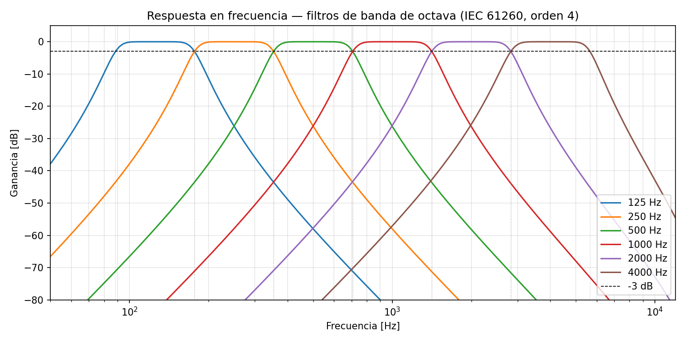

# Validación Milestone 2 — Procesamiento de la Respuesta al Impulso

Las gráficas fueron generadas con el script `generate_m2.py` sobre dos IRs reales de la
base de datos **OpenAIR**:
- **Elveden Hall** (Suffolk, Inglaterra) — sala grande, T60 largo (~3 s)
- **Maes Howe** (Orkney, Escocia) — recinto pequeño, T60 corto (~0.3 s)

---

## 1. Carga de audio (`cargar_audio`)

La función carga archivos WAV o FLAC y devuelve la señal normalizada entre −1 y 1 junto
con la frecuencia de muestreo leída del header del archivo.

### 1.1 Elveden Hall — Forma de onda

La señal muestra la estructura característica de una RI real:
- **Pico inicial** (sonido directo) en t ≈ 0 s.
- **Decaimiento progresivo** de la envolvente durante ~3 s, correspondiente a las
  reflexiones del recinto.
- **Cola de silencio** a partir de t ≈ 3 s hasta el final del archivo (8 s), que
  representa el piso de ruido de la grabación.

La amplitud máxima es 1.0, confirmando que la normalización funciona correctamente.

### 1.2 Maes Howe — Forma de onda

El decaimiento es considerablemente más rápido que en Elveden Hall, consistente con un
recinto pequeño de piedra. La energía de las reflexiones se extingue en ~0.3 s, y la
cola posterior corresponde al piso de ruido de la medición.

---

## 2. Respuesta en frecuencia (`filtro_octava`)

La función aplica un filtro Butterworth pasa-banda de orden 4 y fase cero (via `filtfilt`)
con frecuencias de corte según IEC 61260:

$$f_{\text{inf}} = \frac{f_c}{\sqrt{2}}, \quad f_{\text{sup}} = f_c \cdot \sqrt{2}$$

Las líneas verticales punteadas marcan las frecuencias de corte teóricas (fc/√2 y fc·√2)
de cada banda. La línea horizontal discontinua indica el nivel de −3 dB.

Se observa que:
- Cada filtro alcanza su máximo (0 dB) en la frecuencia central nominal.
- La ganancia en las frecuencias de corte cae aproximadamente −3 dB, cumpliendo IEC 61260.
- Las bandas no se solapan ni dejan huecos significativos entre 125 Hz y 4000 Hz.
- El roll-off fuera de banda supera los 20 dB por octava, garantizando buena separación entre bandas.
