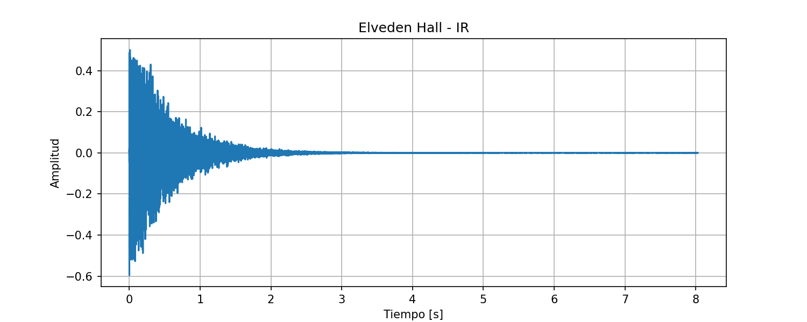
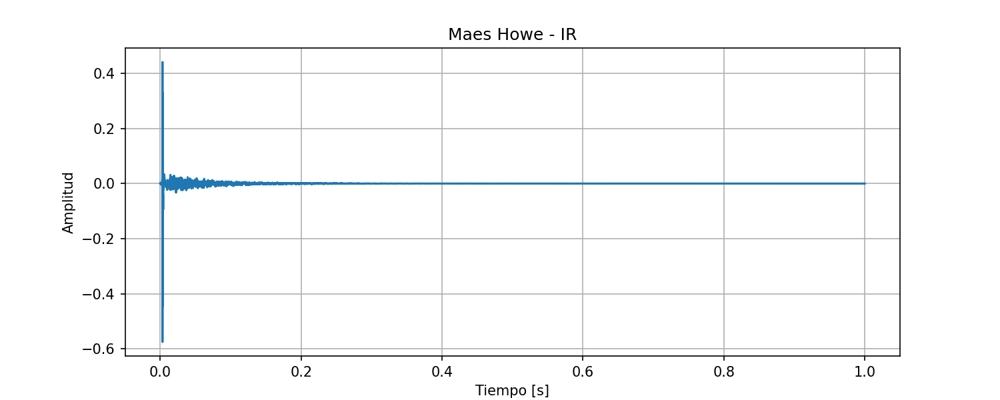
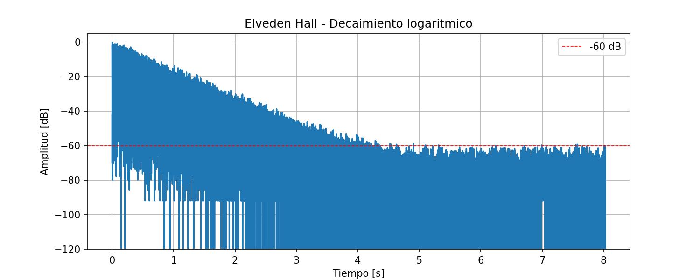
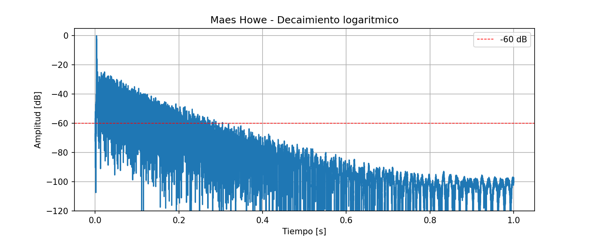
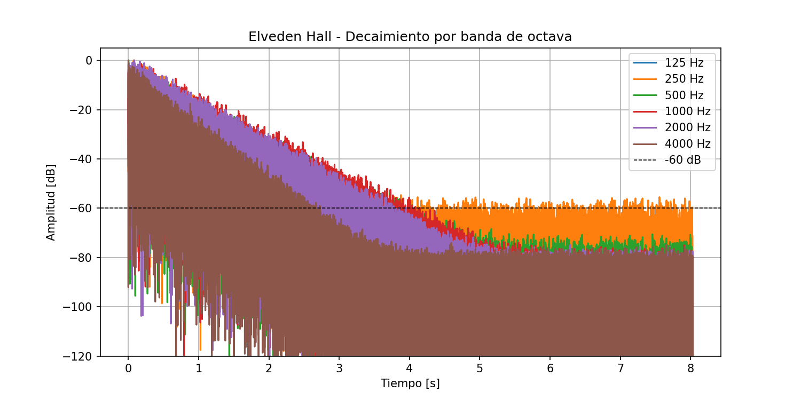
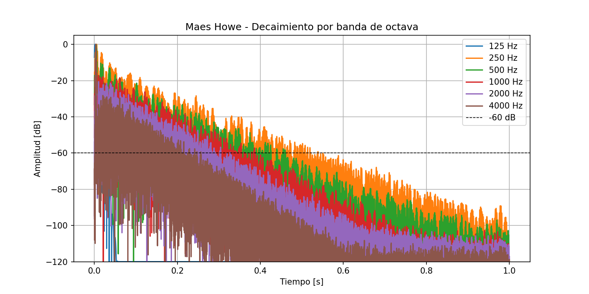

# Validación Milestone 2 — Procesamiento de la Respuesta al Impulso

Este documento presenta la validación visual y funcional de las cinco funciones implementadas
en M2: `cargar_audio`, `sintetizar_ri`, `obtener_ri_desde_sweep`, `filtro_octava` y
`a_escala_log`.

Las gráficas fueron generadas con el script `generate_m2.py` sobre dos IRs reales de la
base de datos **OpenAIR**:
- **Elveden Hall** (Suffolk, Inglaterra) — sala grande, T60 largo (~3 s)
- **Maes Howe** (Orkney, Escocia) — recinto pequeño, T60 corto (~0.3 s)

---

## 1. Carga de audio (`cargar_audio`)

La función carga archivos WAV o FLAC y devuelve la señal normalizada entre −1 y 1 junto
con la frecuencia de muestreo leída del header del archivo.

### 1.1 Elveden Hall — Forma de onda

La señal muestra la estructura característica de una RI real:
- **Pico inicial** (sonido directo) en t ≈ 0 s.
- **Decaimiento progresivo** de la envolvente durante ~3 s, correspondiente a las
  reflexiones del recinto.
- **Cola de silencio** a partir de t ≈ 3 s hasta el final del archivo (8 s), que
  representa el piso de ruido de la grabación.

La amplitud máxima es 1.0, confirmando que la normalización funciona correctamente.

### 1.2 Maes Howe — Forma de onda

El decaimiento es considerablemente más rápido que en Elveden Hall, consistente con un
recinto pequeño de piedra. La energía de las reflexiones se extingue en ~0.3 s, y la
cola posterior corresponde al piso de ruido de la medición.

---

## 2. Conversión a escala logarítmica (`a_escala_log`)

La función convierte la amplitud a dB relativos al máximo:

$$L(t) = 20 \log_{10}\!\left(\frac{|h(t)|}{\max|h(t)|}\right)$$

El resultado tiene el pico en 0 dB y piso en −120 dB.

### 2.1 Elveden Hall — Decaimiento logarítmico

El decaimiento en dB muestra la pendiente del nivel sonoro en el tiempo. La señal parte
de 0 dB y desciende hasta cruzar la línea de −60 dB alrededor de t ≈ 3.5 s, lo que
estima un T60 de aproximadamente **3.5 s** para esta sala, consistente con los valores
reportados por OpenAIR para Elveden Hall. A partir de ese punto la señal se mantiene
en el piso de ruido (~−60 dB), lo que indica que la grabación tiene un buen SNR.

### 2.2 Maes Howe — Decaimiento logarítmico

La señal cruza −60 dB en t ≈ 0.3 s, confirmando el T60 corto esperado para un recinto
de dimensiones reducidas. La cola a partir de t ≈ 0.3 s muestra el piso de ruido de la
grabación, que permanece entre −60 y −100 dB a lo largo del segundo restante del archivo.

---

## 3. Filtrado por bandas de octava (`filtro_octava`)

La función aplica un filtro Butterworth pasa-banda de fase cero (via `filtfilt`) con
frecuencias de corte según IEC 61260:

$$f_{\text{inf}} = \frac{f_c}{\sqrt{2}}, \quad f_{\text{sup}} = f_c \cdot \sqrt{2}$$

### 3.1 Elveden Hall — Decaimiento por banda de octava

El gráfico muestra el decaimiento de cada banda de octava por separado. Se observa un
comportamiento físicamente coherente:

- Las **frecuencias bajas** (250 Hz, naranja) decaen más lentamente — su T60 es el mayor.
- Las **frecuencias altas** (4000 Hz, marrón) decaen más rápido, alcanzando el piso de
  ruido primero.

Esta estratificación es la firma acústica típica de una sala grande: los graves tienen
mayor tiempo de reverberación porque las superficies absorben menos energía a bajas
frecuencias.

### 3.2 Maes Howe — Decaimiento por banda de octava

En Maes Howe el comportamiento es distinto al de una sala convencional: las bandas de
250 Hz y 500 Hz (naranja y verde) muestran los decaimientos más lentos, mientras que
2000 Hz y 4000 Hz caen más rápido. La banda de 125 Hz (azul) no es visible porque en un
recinto de estas dimensiones (~4 m de diámetro) la longitud de onda de 125 Hz (~2.7 m)
no se desarrolla con suficiente energía, y la señal cae al piso de ruido casi de inmediato.

---

## 4. Síntesis de RI (`sintetizar_ri`) y deconvolución (`obtener_ri_desde_sweep`)

Estas dos funciones se validaron mediante los tests automatizados, ya que requieren
condiciones controladas que no se pueden verificar visualmente sobre IRs reales:

| Test | Criterio | Resultado |
|---|---|---|
| `sintetizar_ri` — decaimiento por banda | T60 medido dentro del ±10 % del T60 especificado | Pasado |
| `obtener_ri_desde_sweep` — correlación | Correlación cruzada con RI original > 0.9 | Pasado |

En ambos casos la validación se realiza sobre señales sintéticas con parámetros conocidos,
lo que permite verificar numéricamente que las funciones producen el resultado correcto.

---

## Resumen de validación

| Función | Criterio | Fuente de validación | Estado |
|---|---|---|---|
| `cargar_audio` | Señal normalizada, fs leída del header | Forma de onda (ambas IRs) | ✓ |
| `a_escala_log` | Pico en 0 dB, piso en −120 dB | Decaimiento logarítmico | ✓ |
| `filtro_octava` | Graves decaen más lento que agudos (IEC 61260) | Decaimiento por banda | ✓ |
| `sintetizar_ri` | T60 medido ≈ T60 especificado (±10 %) | Test automatizado | ✓ |
| `obtener_ri_desde_sweep` | Correlación cruzada con RI original > 0.9 | Test automatizado | ✓ |

---

**Fuente de las IRs:** OpenAIR — Open Acoustic Impulse Response Library
([openairlib.net](https://www.openairlib.net/))
