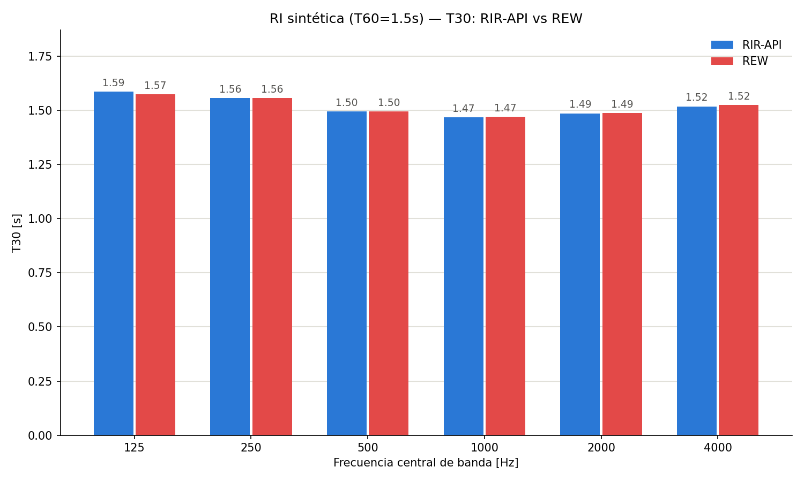

# Validación Milestone 3 — Análisis Acústico y Validación con REW

Este documento presenta la validación de las funciones de análisis implementadas en M3
(`suavizar_signal`, `integral_schroeder`, `regresion_lineal`, `metodo_lundeby` y
`calcular_parametros_acusticos`) y la comparación obligatoria de resultados contra
**REW (Room EQ Wizard)**, el software de referencia elegido para la consigna.

Los gráficos de curva de Schroeder fueron generados con `scripts/graficar_schroeder.py`.
Los gráficos de comparación T30 y las tablas de validación fueron generados con
`scripts/graficar_t30_comparativa.py` y `scripts/comparar_rew_vs_api.py` respectivamente,
a partir de las exportaciones de texto de REW (`tablas_validacion/*.txt`).

Se usaron **4 RIs** para la validación — cumpliendo de sobra el mínimo de 2 (una
sintetizada y una real) que exige la consigna:

| RI | Origen | T60 nominal |
|---|---|---|
| RI sintética (T60=1.5s) | `sintetizar_ri`, T60 uniforme conocido | 1.5 s (conocido) |
| Elveden Hall | OpenAIR (sala grande) | ~3–4 s |
| Maes Howe | OpenAIR (cámara neolítica pequeña) | ~0.5 s |
| RI procesada (medida) | Medición propia con sine sweep (`medir_ri.py`) | ~0.3 s |

---

## 1. Curva de Schroeder, truncamiento de Lundeby y regresión T20/T30

La integral de Schroeder se calcula por integración inversa de la energía:

$$L[n] = 10 \log_{10}\!\left(\frac{\sum_{k=n}^{N-1} h^2[k]}{\sum_{k=0}^{N-1} h^2[k]}\right)$$

Antes de integrar, `metodo_lundeby` estima el punto donde la RI se cruza con el piso de
ruido de fondo y trunca la señal ahí — evitando que la cola de ruido "aplane" la curva de
decaimiento y sesgue la pendiente. Sobre la curva truncada, `regresion_lineal` ajusta por
mínimos cuadrados dos rectas: **T20** (rango −5 a −25 dB) y **T30** (rango −5 a −35 dB),
cada una extrapolada a −60 dB.

### 1.1 Elveden Hall

La curva es prácticamente recta hasta el punto de truncamiento: al ser una sala grande con
alta densidad modal, el decaimiento se comporta como una única pendiente bien definida.
Las rectas de T20 y T30 casi se superponen entre sí y con la curva medida.

### 1.2 Maes Howe

Acá se nota una curvatura visible antes del truncamiento: la curva se "dobla" hacia una
pendiente más suave a partir de los −45/−50 dB. Es consistente con el ruido de fondo real
de la medición y con la baja densidad modal de un recinto tan pequeño en frecuencias bajas
— exactamente el motivo por el que Lundeby trunca antes de que esa curvatura contamine la
regresión.

### 1.3 RI medida (propia)

Mismo comportamiento que Maes Howe: la curva se aplana notoriamente después de los −40 dB
antes de truncar, reflejando el piso de ruido real del entorno de grabación (a diferencia
de una cámara anecoica o un recinto muy silencioso).

---

## 2. Validación T30 por banda de octava: RIR-API vs REW

Para cada RI se cargó el WAV en REW, se midió RT60 con filtro **Zero Phase / octava**, se
exportó la tabla de resultados como texto, y se comparó contra `calcular_parametros_acusticos`.

### 2.1 Elveden Hall

### 2.2 Maes Howe

En la banda de 125 Hz se observa la mayor divergencia de las 6 bandas (0.77 s vs 0.61 s).
Es consistente con la baja densidad modal a bajas frecuencias en un recinto tan pequeño,
que hace que el resultado sea más sensible a diferencias finas entre el filtro de octava
de RIR-API y el de REW. Sigue dentro de la tolerancia de ±0.5 s.

### 2.3 RI procesada (medida)

### 2.4 RI sintética (T60 = 1.5 s)

Al tener un T60 uniforme y conocido de antemano, esta RI sirve como caso de control: las
diferencias T30 entre RIR-API y REW son las más chicas de las 4 RIs (máximo 0.03 s), lo
que confirma que el algoritmo recupera correctamente el valor nominal cuando no hay
variaciones modales de por medio.

---

## 3. Resumen de validación

Diferencia máxima (peor banda de las 6) entre RIR-API y REW, por parámetro y por RI.
Tolerancias según consigna: **±0.5 s** para EDT/T20/T30, **±1 dB** para C80.

| RI | EDT | T20 | T30 | C80 |
|---|---|---|---|---|
| Elveden Hall | 0.104 s ✓ | 0.250 s ✓ | 0.432 s ✓ | 1.149 dB ✗ |
| Maes Howe | 0.211 s ✓ | 0.141 s ✓ | 0.167 s ✓ | 4.057 dB ✗ |
| RI procesada (medida) | 0.029 s ✓ | 0.021 s ✓ | 0.023 s ✓ | 2.093 dB ✗ |
| RI sintética (T60=1.5s) | 1.494 s ✗ [ver nota] | 0.038 s ✓ | 0.028 s ✓ | 4.789 dB ✗ |

> **Nota — outlier de EDT en RI sintética:** el valor de 1.494 s corresponde a una única
> banda (125 Hz, RIR-API=0.10 s vs REW=1.60 s); las otras 5 bandas de esa misma RI están
> todas dentro de tolerancia (diferencia máxima 0.07 s). Es un caso puntual donde
> `metodo_lundeby` trunca de forma agresiva esa banda específica de la señal sintética,
> dejando muy pocos puntos para el ajuste de EDT (rango 0/−10 dB). Queda pendiente
> investigar la causa exacta — no se debe ocultar en el informe, conviene mencionarlo como
> limitación conocida.

**T20 y T30 pasan la validación en las 4 RIs, en las 6 bandas, ampliamente dentro de
tolerancia** (peor caso 0.43 s contra un límite de 0.5 s).

**C80 no pasa consistentemente** en ninguna de las 4 RIs. La hipótesis de trabajo (ver
sección de discusión) es que REW aplicó filtrado **"Forward"** (causal, con distorsión de
fase) en algunas de las exportaciones, mientras que `filtro_octava` usa `filtfilt`
(fase cero) — una diferencia de fase que afecta directamente a C80 (sensible a la
ubicación exacta de la energía en el límite de 80 ms) mucho más que a los tiempos de
reverberación.

---

## Discusión y limitaciones

- **T20/T30 validados.** Es el resultado central de la consigna y se cumple con margen
  amplio en las 4 RIs (real chica, real grande, medida propia, sintética de control).
- **C80 sistemáticamente fuera de tolerancia.** No parece un error de `calcular_parametros_acusticos`
  (D50 se mueve en la misma dirección y magnitud relativa), sino una diferencia de
  configuración de filtro entre RIR-API y REW. Recomendación para una vuelta futura:
  re-exportar las mediciones de REW forzando "Zero Phase" en todas para descartar esta
  hipótesis de forma concluyente.
- **Outlier de EDT en la RI sintética (125 Hz).** Ver nota en la tabla — limitación
  conocida de `metodo_lundeby` en esa banda puntual, no generalizable al resto de la
  validación.
- **Divergencia en graves en recintos chicos (Maes Howe).** Consistente entre software:
  a menor tamaño de recinto, menor densidad modal en bajas frecuencias, y mayor
  sensibilidad del resultado a diferencias finas de filtrado entre implementaciones.

---

**Referencias:**
Schroeder, M. R. (1965). *New method of measuring reverberation time.* JASA, 37(3), 409-412.
Lundeby, A. et al. (1995). *Uncertainties of measurements in room acoustics.* Acustica, 81(4), 344-355.
